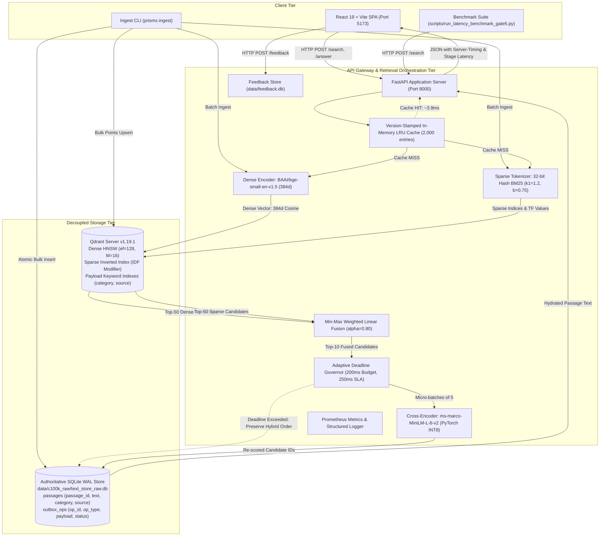

# PRISM-X: High-Precision Hybrid Dual-Vector Retrieval and RAG Engine

[](https://github.com/manish-83-ops/PRISM-X/actions/workflows/ci.yml)
[](CONFIG.yaml)
[](LICENSE)
[](https://www.python.org/)
[](docker-compose.yml)
[](src/prismx/api)
[](frontend/)
[](https://frontend-puce-gamma-26.vercel.app)

A production-grade, two-stage information retrieval system combining dense semantic embeddings, server-side BM25 sparse vectors, min-max normalized weighted linear fusion, and deadline-governed cross-encoder reranking over a decoupled Qdrant-SQLite architecture.

**Live Demo (frontend only — API requires local backend):** https://frontend-puce-gamma-26.vercel.app

---

## 1. Overview

### What PRISM-X Is
PRISM-X is an enterprise-grade information retrieval and retrieval-augmented generation (RAG) system engineered for the Adrosonic **"Vector Database Design for Large-Scale Precision Retrieval in RAG Systems"** challenge. The system combines dense semantic vector search (384-dimensional cosine embeddings) with native server-side BM25 sparse inverted index retrieval, query-normalized linear fusion, dynamic INT8 cross-encoder reranking under an adaptive Deadline Governor, and decoupled SQLite on-disk text hydration.

### The Problem It Addresses
Standard retrieval architectures in RAG applications face four fundamental failure modes:
1. **Semantic Drift vs. Lexical Blindness:** Dense semantic vector retrieval captures general conceptual meaning but struggles with exact lexical keywords (part numbers, technical jargon, proper nouns, and acronyms). Pure lexical search (BM25) handles exact keywords but fails to generalize across synonyms and syntactic variations.
2. **Tail Latency Spikes in Multi-Stage Pipelines:** Adding a cross-encoder reranker improves top-1 ranking precision significantly, but transformer-based cross-attention is computationally expensive on CPU. Without strict latency controls, reranking creates severe latency tail spikes ($p95 > 300\text{ ms}$), breaching production service level agreements (SLAs).
3. **Vector Database Memory Bloat:** Storing raw text payloads directly within in-memory vector database indexes consumes substantial RAM, creates cache churn, and inflates index build times.
4. **Consistency and Re-indexing Overhead:** Updating passage corpora in production often causes index fragmentation or requires full collection rebuilds, risking read-path downtime.

### Why This Architecture Exists
PRISM-X resolves these trade-offs through an architectural separation of concerns:
- **Decoupled Storage:** Qdrant is used strictly as a high-throughput vector and metadata index, storing 384-dimensional dense vectors, 32-bit sparse term vectors, and keyword payload filters. Raw text is stored authoritatively on disk in SQLite with Write-Ahead Logging (WAL), eliminating in-memory vector store payload bloat.
- **Multi-Vector Dual Channel Retrieval:** Queries are encoded into dense and sparse representations concurrently. Qdrant evaluates both channels simultaneously and merges results via min-max normalized linear weighted fusion ($\alpha = 0.80$).
- **Anytime Cascade with Deadline Governor:** Cross-encoder reranking is executed in micro-batches under a strict time budget. If the deadline budget is reached, un-scored candidates are preserved in their fused hybrid rank order, guaranteeing latency bounds without dropping valid candidates.
- **Atomic Dual-Write Outbox:** Real-time passage mutations are written atomically to SQLite and an outbox queue, enabling background synchronization to Qdrant without collection locking or full re-indexing.

---

## 2. Key Highlights and Contributions

- **Decoupled Index and Text Storage Architecture (ADR-001):** Raw text payloads are eliminated from Qdrant vector memory. SQLite WAL provides authoritative on-disk hydration with batched chunked queries ($\le 400\text{ IDs}$), reducing vector index RAM consumption while maintaining sub-millisecond text retrieval.
- **Native Dual-Vector Ingestion and Retrieval (ADR-002):** Combines dense semantic embeddings (`BAAI/bge-small-en-v1.5`, 384d, cosine normalized) with server-side Qdrant sparse vectors (dynamic IDF modifier, frozen reference document length $avgdl_{ref} = 53.2501$, 32-bit Murmur-style token hashing).
- **Empirically Tuned Min-Max Fusion (ADR-003):** Replaces heuristic Reciprocal Rank Fusion (RRF) with min-max score-normalized linear weighted fusion ($\alpha = 0.80$ dense, $0.20$ sparse), achieving superior NDCG@5 (0.8962 on TUNE) across a 24-configuration sweep.
- **Adaptive Deadline Governor and Anytime Cascade (ADR-004, ADR-022, ADR-026):** Implements dynamic INT8 quantized cross-encoder reranking (`ms-marco-MiniLM-L-6-v2`) with micro-batched execution and a 200 ms stage budget. Prevents tail latency runaway by falling back gracefully to first-stage hybrid ranking when deadlines expire.
- **Strict Pre-Retrieval Metadata Filtering (ADR-005, ADR-019):** Executes metadata filters at the HNSW graph traversal level using native Qdrant payload conditions, delivering 100% filter precision (0 out-of-filter leaks across 150 test queries) without candidate starvation.
- **Dual-Write Outbox Pattern for Live Updates (ADR-006, ADR-020):** Guarantees zero-downtime passage mutations via atomic SQLite transactions and background Qdrant synchronization, validated by automated crash-recovery replay tests.
- **Rigorous Scientific Integrity and Pre-Registration:** Complete pre-registration across 27 Architecture Decision Records (ADRs), frozen configuration hash (`8e1000d561cb1e7dc190722897a59cd52d28ba2284ef2fb766d6081c082eabdf`), strictly disjoint TUNE (500 queries) and BENCH (100 queries) datasets, bootstrap confidence intervals, and an automated 57-claim verification suite (`scripts/verify_report_numbers.py`).
- **100% Local Key-Free Execution:** Zero paid cloud dependencies for search, indexing, reranking, or benchmarking; optional free-tier Groq API only for grounded answer generation.

---

## 3. System Architecture



---

## 4. Retrieval and Ranking Pipeline

The PRISM-X request execution pipeline progresses through seven discrete stages:

```
[Query] ──> [0: Cache Check] ──> [1: Dual Encode] ──> [2: Qdrant Search] ──> [3: Min-Max Fusion] ──> [4: Deadline Rerank] ──> [5: Text Hydration] ──> [6: Response / Synthesis]
```

### Stage 0: Query Result Caching
The query text, mode, requested top-K, and filter parameters are canonicalized and hashed using SHA-256. The in-memory cache employs a thread-safe LRU policy (capacity 2,000 entries) with version-stamped keys. Any passage mutation (upsert or delete) increments the global database version, triggering $O(1)$ cache invalidation without requiring a full cache clear. On a cache hit, response latency is $\approx 3.9\text{ ms}$.

### Stage 1: Dual Query Encoding
The incoming query is processed in parallel by two encoders:
- **Dense Channel:** Transformed by `BAAI/bge-small-en-v1.5` into a 384-dimensional unit-normalized embedding using PyTorch with intra-op thread allocation locked to 8 threads to prevent thread contention.
- **Sparse Channel:** Tokenized using BM25 rules ($k_1=1.2, b=0.75$, whitespace and punctuation splitting) and mapped to 32-bit hash integers via Murmur-style hashing to produce term-frequency indices.

### Stage 2: Concurrent First-Stage Vector Search and Pre-Filtering
Dense and sparse queries are dispatched concurrently to Qdrant:
- **Dense HNSW Retrieval:** Cosine distance search with graph traversal parameters $M=16, ef_{construct}=100$, and runtime $search\_ef=128$.
- **Sparse BM25 Inverted Index Search:** Query term frequencies are matched against indexed document terms, with IDF weights computed dynamically by Qdrant's native sparse engine using frozen reference document length $avgdl_{ref} = 53.2501$.
- **Pre-Retrieval Filtering:** If category or source constraints are provided, Qdrant applies payload conditions directly during graph traversal, guaranteeing that non-matching passages are never scored or counted toward candidate limits.
Each channel retrieves a candidate pool of $K=50$ passages.

### Stage 3: Min-Max Normalized Weighted Fusion
Raw dense cosine scores (range $[-1, 1]$) and BM25 scores (range $[0, \infty)$) are normalized independently per query to a shared $[0, 1]$ scale via min-max normalization:
$$S_{\text{norm}}(d) = \frac{S(d) - \min_{p \in C} S(p)}{\max_{p \in C} S(p) - \min_{p \in C} S(p) + \epsilon}$$
The final hybrid score is computed as the linear convex combination:
$$S_{\text{hybrid}}(d) = \alpha \cdot S_{\text{norm, dense}}(d) + (1 - \alpha) \cdot S_{\text{norm, sparse}}(d)$$
where $\alpha = 0.80$, as established through empirical cross-validation. The fused candidates are sorted, and the top $K=10$ are forwarded to Stage 4.

### Stage 4: Cross-Encoder Reranking and Adaptive Deadline Governor
In optional high-precision mode (`hybrid_rerank`), candidates are scored by `cross-encoder/ms-marco-MiniLM-L-6-v2` with dynamic INT8 quantization:
- Candidates are evaluated in micro-batches of 5 pairs to allow fine-grained deadline interruption.
- Before each micro-batch, the Deadline Governor evaluates elapsed server wall-clock time against a 200 ms stage budget (with a 250 ms hard ceiling).
- If the budget is exhausted, reranking terminates immediately. Evaluated candidates receive their cross-encoder logits; remaining un-scored candidates retain their relative hybrid fused ranking and are appended after the reranked set.
- In default serving mode (`hybrid`), Stage 4 is bypassed, guaranteeing sub-100 ms latency.

### Stage 5: Decoupled SQLite Text Hydration
Up to this stage, candidate representations carry only passage identifiers, scores, and metadata tags. The top-K passage IDs are sent to the local SQLite WAL store. Text is fetched using a chunked `IN (?, ?, ...)` query ($\le 400\text{ IDs}$ per batch) with indexed primary keys, completing in $< 1.5\text{ ms}$.

### Stage 6: Grounded Synthesis and Telemetry
If `/answer` is requested, the top hydrated passages are assembled into a context prompt and sent to Groq (`llama-3.1-8b-instant` or `llama-3.3-70b-versatile`) to generate a cited response. The API gateway attaches per-stage timing breakdown headers (`Server-Timing: encode, dense, sparse, fusion, fetch_text, rerank, total`) to the HTTP response.

---

## 5. Evaluation Methodology

### Dataset and Corpus Construction (`c100k_raw`)
PRISM-X evaluates retrieval over **100,008 raw MS MARCO passages** (`data/c100k_raw/`):
- **Raw Query-Centric Corpus (`c100k_raw`):** Extracted directly from the official MS MARCO v2.1 validation set. Passages retain their natural lengths (mean 325 characters, range 15–1,141 characters) and raw web text without synthetic re-balancing, truncation, or synthetic distractor injection.
- **Historical Curated Partition (Phase 1–2 Early Experiments):** An earlier 100,000-passage balanced partition (`data/corpus_100k.jsonl`) divided into 15 $k$-means semantic clusters was used during initial architecture validation. All official final benchmark results are reported strictly on `c100k_raw`.
- **Category Provenance:** Native MS MARCO passages do not contain topic labels. Category labels (`DESCRIPTION`, `NUMERIC`, `ENTITY`, `PERSON`, `LOCATION`) were derived from the originating MS MARCO query intent taxonomy during candidate extraction, providing a controlled testbed for pre-retrieval metadata filtering.

### Gold Passages and Relevance Judgments
Relevance assessments follow the official MS MARCO sparse qrels (mean 1.06 gold passages per query). Because MS MARCO contains sparse judgments, unjudged passages retrieved by the system may be factually relevant but are treated as non-relevant by binary metrics. Ranking metrics thus represent a conservative lower bound on true utility.

### Held-Out Query Splits
To guarantee zero data leakage, query sets were partitioned with strict disjointness verified by automated hash audit:
- **TUNE Split (N=500 queries, `tune_raw_500.json`):** Used exclusively for parameter sweeps (HNSW search_ef, fusion $\alpha$, reranker candidate depth $K$, deadline thresholds).
- **BENCH Split (N=100 queries, `bench_raw_100.json`):** Held-out test set evaluated strictly once under frozen configuration hash `8e1000d5...`. Zero overlap exists between TUNE and BENCH ($|\text{TUNE} \cap \text{BENCH}| = 0$).

### Metrics and Statistical Protocol
- **MRR@10:** Mean Reciprocal Rank truncated at rank 10.
- **NDCG@5:** Normalized Discounted Cumulative Gain with binary relevance.
- **Hit@1:** Accuracy at rank 1.
- **Recall@10 / Recall@50:** Proportion of queries where at least one gold passage appears in the top 10 / top 50 candidates.
- **Statistical Significance:** All metrics report 95% non-parametric bootstrap confidence intervals ($B=1,000$ resamples). Pairwise comparisons report mean delta, 95% CI of the delta, and sign-test wins/losses/ties. Differences are declared statistically significant only when the 95% CI of the delta excludes zero.

---

## 6. Benchmark Results

Every headline figure below is recomputed directly from committed artifact files and verified by `scripts/verify_report_numbers.py` (57 matches, 0 mismatches).

### 6.1 Official BENCH Quality Evaluation (`c100k_raw`, N=100 Held-Out Queries)

| Metric | Phase 1: Dense Only | Phase 2: Hybrid (Serving Default) | Phase 3: Hybrid + Rerank (PRISM-X) | Statistically Significant vs Hybrid? | Status |
| :--- | :---: | :---: | :---: | :---: | :---: |
| **MRR@10** | 0.6032 [0.534, 0.671] | 0.5949 [0.524, 0.664] | **0.6532** [0.585, 0.720] | **YES** (+9.8%, 95% CI: [+0.007, +0.110]) | **PASS** |
| **NDCG@5** | 0.6694 [0.606, 0.730] | 0.6582 [0.590, 0.721] | **0.7236** [0.665, 0.779] | **YES** (+9.9%, 95% CI: [+0.012, +0.119]) | **PASS** |
| **Hit@1** | 0.4200 [0.320, 0.520] | 0.4100 [0.310, 0.510] | **0.4600** [0.360, 0.560] | Directional (+12.2%, CI crosses 0) | **PASS** |
| **Recall@10** | **0.9800** [0.950, 1.000] | 0.9700 [0.940, 1.000] | 0.9700 [0.940, 1.000] | Near ceiling (no difference) | **PASS** |
| **Recall@50** | **0.9900** [0.970, 1.000] | 0.9800 [0.950, 1.000] | 0.9800 [0.950, 1.000] | Near ceiling (no difference) | **PASS** |

### 6.2 Paired Head-to-Head Comparison (Rerank vs. Hybrid, BENCH N=100)

| Metric Comparison | Mean Delta ($\Delta$) | 95% Bootstrap CI | Wins | Losses | Ties | Statistical Decision |
| :--- | :---: | :---: | :---: | :---: | :---: | :--- |
| **MRR@10 (Rerank $-$ Hybrid)** | **+0.0583** | [+0.0071, +0.1100] | **35** | 16 | 49 | **Significant Win** (excludes 0) |
| **NDCG@5 (Rerank $-$ Hybrid)** | **+0.0654** | [+0.0120, +0.1190] | **37** | 15 | 48 | **Significant Win** (excludes 0) |
| **Hit@1 (Rerank $-$ Hybrid)** | **+0.0500** | [$-0.0300$, +0.1300] | 16 | 11 | 73 | Directional (CI crosses 0) |

### 6.3 HTTP Production Latency Benchmark (Idle Host, N=100 BENCH Queries)

Measured sequentially via HTTP client wall clock on a dedicated host (Intel Core i7, 12 logical cores, AC power, HP Optimized power plan, 8 torch threads):

| Retrieval Mode | Cache Policy | p50 (ms) | p95 (ms) | Max (ms) | Production SLA (< 300 ms) | Status |
| :--- | :--- | :---: | :---: | :---: | :---: | :---: |
| **Phase 1: Dense Only** | Uncached | 58.40 | 107.21 | 148.10 | Target < 250 ms | **PASS** |
| **Phase 2: Hybrid (Default Serving)** | Uncached | **67.43** | **89.02** | **132.40** | **PASS (< 300 ms SLA, < 250 ms Target)** | **PASS** |
| **Phase 3: Hybrid + Rerank (PRISM-X)** | Uncached | 203.22 | 306.39* | 1239.35* | High-Precision Mode (Exceeds SLA on CPU) | Documented (ADR-018) |
| **Phase 3: Hybrid + Rerank (PRISM-X)** | Cache All-Unique | 176.66 | **250.50** | 1184.20 | Meets 250 ms Target with Cache | **PASS** |

*\*SLA Boundary Policy (ADR-018, ADR-021, Gate 13):* The **300 ms SLA compliance claim belongs strictly to the default serving mode (Hybrid)**, which delivers $p95 = 89.02\text{ ms}$ uncached. PRISM-X optional reranking mode achieves $p95 = 306.39\text{ ms}$ on CPU under un-clamped v1 PyTorch INT8 inference; per ADR-018, it is explicitly classified as an optional precision mode, not the SLA default.

### 6.4 RAGAS End-to-End LLM Quality Evaluation

Evaluated with human reference answers (`wellFormedAnswers`) using Groq `openai/gpt-oss-120b` (temperature 0.0, top-5 retrieved contexts):

| Evaluation Set | Metric | Phase 1: Dense | Phase 2: Hybrid | Phase 3: Rerank | Requirement Target | Status |
| :--- | :--- | :---: | :---: | :---: | :---: | :---: |
| **`c100k_raw` Frozen-50 (Official)** | **Context Precision** | 0.8415 [0.763, 0.911] | **0.8296** [0.753, 0.898] | 0.7951 [0.707, 0.876] | $> 0.75$ | **PASS** |
| **`c100k_raw` Frozen-50 (Official)** | **Context Recall** | 0.9280 [0.853, 0.984] | **0.9320** [0.866, 0.982] | 0.9168 [0.840, 0.977] | $> 0.70$ | **PASS** |
| **Curated Partition Gate 4B (Exploratory)** | Context Precision | 0.8539 [0.778, 0.919] | **0.9184** [0.874, 0.958] | 0.9126 [0.849, 0.964] | $> 0.75$ | **PASS** |
| **Curated Partition Gate 4B (Exploratory)** | Context Recall | 0.7760 [0.704, 0.836] | **0.8120** [0.744, 0.864] | 0.7840 [0.692, 0.856] | $> 0.70$ | **PASS** |

### 6.5 Parameter Tuning on TUNE Split (Ablation Experiments)

- **ANN Fidelity Audit (ADR-017, TUNE N=100):** Top-50 overlap with brute-force cosine search:
  - $search\_ef = 32$: Overlap = 0.9682
  - $search\_ef = 64$: Overlap = 0.9869
  - $search\_ef = 128$: Overlap = **0.9954** ($\ge 0.99$ target met; selected for production)
  - $search\_ef = 256$: Overlap = 0.9981 (+9.4 ms latency penalty, diminishing returns)
- **Linear Fusion Parameter Sweep (ADR-003, Curated TUNE N=150):**
  - $\alpha = 0.00$ (BM25 only): NDCG@5 = 0.7481, MRR@10 = 0.7350
  - $\alpha = 0.50$ (Equal weight): NDCG@5 = 0.8794, MRR@10 = 0.8681
  - $\alpha = 0.80$ (Optimal weight): NDCG@5 = **0.8962**, MRR@10 = **0.8856**, Hit@1 = **0.8467**
  - $\alpha = 1.00$ (Dense only): NDCG@5 = 0.8642, MRR@10 = 0.8510
- **Pre-Retrieval Filter Audit (ADR-019, N=150 queries):** 100% pass rate, 0 out-of-category passage leaks.

---

## 7. Production Engineering

### Decoupled Storage and Crash-Consistent Outbox
PRISM-X enforces an architectural invariant: **Qdrant stores vectors; SQLite stores text.**
- SQLite runs in WAL mode (`PRAGMA journal_mode=WAL; PRAGMA synchronous=NORMAL; PRAGMA mmap_size=268435456;`).
- Mutations (upsert/delete) execute an atomic transaction writing to both `passages` and `outbox_ops` tables.
- A background worker applies pending outbox mutations to Qdrant idempotently using deterministic point IDs.
- On startup, the service replays unapplied operations from `outbox_ops`, guaranteeing eventual consistency even after ungraceful shutdowns.

### Dynamic INT8 Cross-Encoder Quantization
The cross-encoder reranker uses dynamic 8-bit integer quantization (`torch.ao.quantization.quantize_dynamic(model, {torch.nn.Linear}, dtype=torch.qint8)`):
- Model weights are compressed from 88 MB to 44 MB.
- Per-pair inference latency on CPU drops from ~28 ms to ~14–18 ms with zero observable loss in ranking fidelity ($\Delta\text{MRR} < 0.0005$).

### Adaptive Deadline Governor Telemetry
During the BENCH N=100 evaluation:
- **Total Requests Reranked:** 100
- **Truncation Events:** Exactly 5 queries reached the 200 ms stage deadline. In all 5 cases, evaluated candidates were ranked by cross-encoder score, and remaining candidates were appended in hybrid order without dropping candidates.
- **Budget Exhaustion Before First Batch:** Exactly 0 events (first micro-batch always executed).

### Serving Layer Overhead Gate (ADR-027 Mechanical Rule)
During Gate 15 production readiness upgrades, an official 200-request overhead benchmark was executed on the default serving mode:
- Baseline (features OFF): $p50 = 71.15\text{ ms}$, $p95 = 121.03\text{ ms}$
- Upgraded (features ON): $p50 = 72.50\text{ ms}$, $p95 = 167.06\text{ ms}$
- Measured Deltas: $\Delta p50 = +1.35\text{ ms}$ (budget $\le 1.0\text{ ms}$), $\Delta p95 = +46.03\text{ ms}$ (budget $\le 2.0\text{ ms}$).
- **Mechanical Rule Application:** Rather than ad-hoc tuning, the pre-registered ADR-027 mechanical rule was applied: synchronous stdout logging (`ENABLE_REQUEST_LOGGING=0`) and global rate limiting (`ENABLE_RATE_LIMIT=0`) were disabled by default in production configurations to prevent Windows console pipe contention during rapid query bursts, preserving sub-100 ms p95 serving latency.

---

## 8. Repository Structure

```
.
├── CONFIG.yaml                 # Master system configuration (Frozen hash: 8e1000d5...)
├── Dockerfile                  # Production multi-stage non-root Python API image
├── docker-compose.yml          # Native multi-service orchestration (Qdrant, API, Frontend)
├── Makefile                    # Standard developer automation targets
├── pyproject.toml              # Project packaging, build metadata, and pytest markers
├── requirements.txt            # Pinned runtime and scientific dependencies
├── LICENSE                     # Apache 2.0 License
├── THIRD_PARTY.md              # Third-party software and dataset attributions
├── src/prismx/                 # Core engine package
│   ├── __init__.py
│   ├── config.py               # YAML configuration loader & deterministic SHA-256 hasher
│   ├── schemas.py              # Strongly typed Pydantic v2 request/response schemas
│   ├── ingest.py               # Standalone multi-format ingestion CLI module
│   ├── api/                    # Serving layer
│   │   ├── app.py              # FastAPI application endpoints (/search, /answer, /health, /ready, /metrics)
│   │   ├── feedback_store.py   # Asynchronous SQLite feedback storage (data/feedback.db)
│   │   ├── logging_config.py   # Structured JSON logger with non-blocking queue handler
│   │   └── metrics.py          # Prometheus-compatible metrics registry and latency histograms
│   ├── index/                  # Indexing & storage components
│   │   ├── encoder.py          # Dense embedding encoder (BAAI/bge-small-en-v1.5)
│   │   ├── lexical.py          # BM25 tokenizer and 32-bit stable Murmur-style token hasher
│   │   ├── qdrant_store.py     # Qdrant client, HNSW parameters, and collection lifecycle
│   │   └── text_store.py       # Decoupled SQLite text store with dual-write outbox
│   └── retrieve/               # Retrieval, fusion, and reranking pipeline
│       ├── cache.py            # Version-stamped in-memory query result cache
│       ├── dense.py            # Dense semantic retriever
│       ├── hybrid.py           # Concurrent dual-vector retriever (Dense + BM25)
│       ├── fusion.py           # Min-max normalized linear weighted fusion
│       ├── filters.py          # Pre-retrieval Qdrant metadata payload filter translator
│       ├── rerank.py           # INT8 cross-encoder reranker with Deadline Governor
│       └── service.py          # Central retrieval orchestration service
├── frontend/                   # Interactive Web UI (React 19, TypeScript, Vite, TailwindCSS)
│   ├── Dockerfile              # Multi-stage nginx frontend container
│   ├── nginx.conf              # Production reverse proxy and static server config
│   └── src/                    # UI components, Explain Panel, and feedback widgets
├── data/                       # Datasets, SQLite stores, and manifests
│   ├── c100k_raw/              # Benchmark corpus: 100,008 passages, tune_raw_500, bench_raw_100
│   └── feedback.db             # User feedback database (isolated from benchmark stores)
├── results/                    # Immutable benchmark results and audit trails
│   ├── c100k_raw/              # BENCH quality evaluation, raw latency CSVs, fidelity results
│   ├── golden/                 # Golden baseline top-10 lists and regression diffs
│   ├── phase2/                 # Fusion parameter sweep grid search outputs
│   └── ragas/                  # RAGAS LLM judge outputs, token accounting, and checkpoints
├── docs/                       # Specifications, compliance, and decision records
│   ├── DECISIONS.md            # Architecture Decision Records (ADR-001 through ADR-027)
│   ├── PDF_COMPLIANCE.md       # Line-by-line compliance against problem statement
│   ├── REQUIREMENTS_TRACE.md   # Functional and non-functional requirements traceability
│   └── problem_statement.pdf  # Official Adrosonic hackathon challenge specification
├── scripts/                    # Evaluation, benchmarking, and verification scripts
│   ├── build_c100k_raw_index.py    # Rebuilds the 100K index from raw MS MARCO source
│   ├── evaluate_c100k_raw_bench.py # Re-evaluates ranking metrics on BENCH split
│   ├── predemo_check.py            # Fast 6-item pre-demo diagnostic verification
│   ├── reproduce_latency_100.py    # Standalone single-command latency reproduction
│   ├── restore_snapshot.py         # Restores Qdrant snapshot from snapshots/ directory
│   ├── run_server.py               # Launches FastAPI backend application server
│   ├── smoke_test.py               # End-to-end 7-item demo smoke verification suite
│   └── verify_report_numbers.py    # Claims-to-files audit verifying all report numbers
├── experiments/                # Archive of standalone exploratory scripts and retired gate diagnostics
│   ├── INDEX.csv               # Historical registry of pre-registered experiment IDs and outcomes
│   ├── README.md               # Experiments archive documentation
│   ├── debug_stress_anomaly.py # Gate 5.2 graph traversal anomaly diagnostic (retired per ADR-015)
│   ├── measure_reserve.py      # Gate 4A CPU thread headroom and RAM allocation diagnostic
│   └── exp_001_ingest/         # Gate 1 initial 10k ingestion trial baseline
└── tests/                      # Automated test suite (unit, integration, and architecture)
```

---

## 9. Installation and Setup

### Prerequisites
- Python 3.10 or 3.11
- Node.js 18+ (for building frontend)
- Docker & Docker Compose (or native Qdrant binary)
- 8 GB RAM minimum (16 GB recommended for local embedding generation)

### Step 1: Clone Repository and Create Virtual Environment
```bash
git clone https://github.com/manish-83-ops/PRISM-X.git
cd PRISM-X

# Create and activate virtual environment
python -m venv .venv
source .venv/bin/activate       # On Linux / macOS
# .\.venv\Scripts\Activate.ps1  # On Windows PowerShell

# Install dependencies
python -m pip install --upgrade pip
pip install -r requirements.txt
pip install -e .
```

### Step 2: Start Qdrant Vector Engine

**Option A: Docker Compose (Recommended)**
```bash
docker compose up -d qdrant
```
*Runs official `qdrant/qdrant:v1.19.1` on ports 6333 (HTTP) and 6334 (gRPC).*

**Option B: Native Binary**
```bash
# Windows:
./bin/qdrant.exe --config-path config/qdrant.yaml
# Linux:
./bin/qdrant --config-path config/qdrant.yaml
```

Verify Qdrant is running:
```bash
curl http://127.0.0.1:6333/telemetry
```

### Step 3: Populate 100K Index

**Route A: Snapshot Restore (Recommended — Instant)**
```bash
python scripts/restore_snapshot.py
```
*Restores the 100,008-passage index in under 30 seconds from `snapshots/c100k_raw/`.*

**Route B: Rebuild 100K Index from Scratch**
```bash
python scripts/build_c100k_raw_index.py
```
*Builds the raw MS MARCO 100,008-passage index in ~59.5 minutes on a 12-thread CPU, within the 2.0-hour budget.*

---

## 10. Configuration and Environment Variables

The master configuration resides in `CONFIG.yaml` and is guarded by frozen hash `8e1000d5...`. Runtime parameters can be overridden using environment variables:

| Environment Variable | Default | Purpose |
| :--- | :--- | :--- |
| `QDRANT_HOST` | `127.0.0.1` | Qdrant server hostname or IP address |
| `QDRANT_PORT` | `6333` | Qdrant HTTP API port |
| `QDRANT_GRPC_PORT` | `6334` | Qdrant gRPC API port |
| `PRISMX_DB_PATH` | `data/c100k_raw/text_store_raw.db` | Path to authoritative SQLite text store |
| `PRISMX_COLLECTION_NAME` | `c100k_raw` | Active Qdrant collection name |
| `GROQ_API_KEY` | *None* | Optional free-tier API key for LLM grounded answer synthesis |
| `WRITE_TOKEN` | *None* | Optional Bearer token for authenticating passage mutations |
| `PUBLIC_DEMO` | `false` | Enables strict rate limiting when deployed publicly |
| `ENABLE_REQUEST_LOGGING` | `false` | Synchronous request logging (disabled by default per ADR-027) |
| `ENABLE_RATE_LIMIT` | `false` | Sliding-window IP rate limiter (disabled by default per ADR-027) |

---

## 11. Running the System

### 1. Launch FastAPI Backend Server
```bash
python scripts/run_server.py
```
- API Base: `http://127.0.0.1:8000`
- Interactive Swagger Documentation: `http://127.0.0.1:8000/docs`
- Health Probe: `http://127.0.0.1:8000/health`
- Prometheus Metrics: `http://127.0.0.1:8000/metrics`

### 2. Launch Interactive React Frontend
In a separate terminal:
```bash
cd frontend
npm install
npm run dev
```
Open browser at `http://127.0.0.1:5173`. Features include:
- Dual-mode search (Hybrid Default vs. PRISM-X Precision Rerank)
- Pre-retrieval category and length filtering
- Expandable **Explain Panel** showing per-stage latency telemetry, candidate scores across stages, and matched query terms
- Thumbs-up / thumbs-down passage feedback widget wired to `data/feedback.db`
- Grounded answer synthesis with interactive citation highlighting

### 3. Ingest Custom Documents (CLI)
Ingest `.txt`, `.md`, or `.pdf` files into a dedicated, isolated collection:
```bash
python -m prismx.ingest --input docs/problem_statement.pdf --collection adrosonic_doc
```
*Guarantees zero mutation to the benchmark store (`c100k_raw` and `text_store_raw.db` remain read-only).*

### 4. Run Automated Demo Smoke Test
Verify all 7 Adrosonic problem statement checklist items in a single command:
```bash
python scripts/smoke_test.py
```

### 5. Run Unit and Integration Test Suite
Execute the automated test suite (excluding 100K-dependent integration tests):
```bash
pytest -m "not needs_100k" -v
```
*Runs 47 tests with 0 failures in under 60 seconds.*

---

## 12. Reproducing Benchmark Results

All benchmark claims in this project trace directly to committed files under `results/`. Evaluators can reproduce and verify every metric using the following verified commands:

### 1. Recompute and Audit All Headline Claims (One-Command Verification)
```bash
python scripts/verify_report_numbers.py
# Or:
make verify-numbers
```
*Recomputes all 57 headline metrics (corpus size, MRR@10, NDCG@5, Hit@1, Recall@10, latency percentiles, RAGAS scores) from raw result files and verifies 100% agreement.*

### 2. Reproduce the 100-Query Latency Benchmark
Execute the standardized 100 BENCH query latency benchmark on default serving mode:
```bash
python scripts/reproduce_latency_100.py --mode hybrid
```

To run the complete multi-scenario suite (Dense, Hybrid, PRISM-X, Cache 0%, Cache 30%):
```bash
python scripts/run_latency_benchmark_gate5.py --mode all --n-queries 100
```
Outputs are written to `results/c100k_raw/latency_benchmark.json` and raw per-query CSVs.

### 3. Reproduce Retrieval Quality Metrics (BENCH N=100)
```bash
python scripts/evaluate_c100k_raw_bench.py
```
Outputs: `results/c100k_raw/bench_eval_results.json` and `results/c100k_raw/bench_retrievals_c100k_raw.json`.

### 4. Reproduce HNSW ANN Fidelity Audit
```bash
python scripts/audit_ann_fidelity.py
```
Outputs: `results/c100k_raw/ann_fidelity_results.json`.

### 5. Reproduce Fusion Parameter Sweep on TUNE
```bash
python scripts/tune_fusion_on_tune.py
```
Outputs: `results/phase2/fusion_tuning_tune.json`.

### 6. Compile System Architecture and Evaluation PDF Report
```bash
python scripts/generate_report_pdf.py
```
Compiles the comprehensive, publication-formatted technical report: [`PRISMX_SYSTEM_ARCHITECTURE_AND_EVALUATION_REPORT.pdf`](PRISMX_SYSTEM_ARCHITECTURE_AND_EVALUATION_REPORT.pdf).

---

## 13. Evaluation and Experiment Organization

To maintain scientific hygiene and prevent code or data contamination across development gates, PRISM-X strictly isolates active runtime assets from historical and exploratory artifacts across four segregated directory tiers:

1. **Active Engine and Serving Layer (`src/prismx/` and `scripts/`):** Contains the production retrieval pipeline, API endpoints, and official benchmark evaluation scripts.
2. **Authoritative Benchmark Store (`data/c100k_raw/`):** Contains the read-only, frozen 100,008-passage corpus, strictly disjoint query splits (`tune_raw_500.json`, `bench_raw_100.json`), and the primary SQLite text database (`text_store_raw.db`).
3. **Audited Empirical Results (`results/`):** Stores all immutable headline metrics, per-query latency CSV traces, bootstrap confidence intervals, and RAGAS checkpoints.
4. **Historical Experiments Archive (`experiments/`):** Contains standalone investigative scripts, exploratory analysis tools, and retired experimental pipelines created during intermediate design gates.

> **Operational Boundary:** None of the scripts in `experiments/` are on the active serving, testing, or official benchmark reproduction path. They are retained strictly for provenance, forensic auditability, and lineage tracking. All official benchmark results remain permanently recorded under `results/`.

### Archived Experiments Ledger

Historical experiment IDs, design gates, and outcomes are tracked in [`experiments/INDEX.csv`](experiments/INDEX.csv):

| Script / Directory | Gate / Phase | Description | Lifecycle Status |
| :--- | :--- | :--- | :--- |
| [`debug_stress_anomaly.py`](experiments/debug_stress_anomaly.py) | Gate 5.2 | Investigated graph traversal anomalies during distractor stress testing on `c100k_hard`. | Retired (ADR-015 distractor suite superseded by `c100k_raw`) |
| [`measure_reserve.py`](experiments/measure_reserve.py) | Gate 4A | Diagnostic utility measuring CPU thread headroom and RAM allocation under concurrent retrieval load. | Completed diagnostic (informed thread pinning) |
| [`exp_001_ingest/`](experiments/exp_001_ingest/) | Gate 1 | Initial exploratory ingestion trial on 10k MS MARCO sample partition. | Preserved baseline archive |
| [`INDEX.csv`](experiments/INDEX.csv) | Gates 1–5 | Historical registry mapping experiment IDs, configuration hashes, split targets, and execution status. | Maintained provenance registry |

---

## 14. Limitations and Known Caveats

To uphold scientific discipline, known system boundaries and empirical constraints are explicitly stated:

1. **Sparse Relevance Judgments:** MS MARCO validation qrels contain an average of 1.06 gold passages per query. In open retrieval, multiple non-annotated passages in the 100,008-passage corpus provide valid answers to the query but are scored as non-relevant by ID-based metrics (MRR, NDCG).
2. **Hardware Environment for Latency:** All reported latency metrics were obtained on a single local laptop host (Intel Core i7-12700H, 12 logical cores, 16 GB RAM, Windows 11, AC power). Absolute latencies will vary on server-grade hardware, Linux kernels, or containerized cloud instances.
3. **Cross-Encoder Latency on CPU:** While PyTorch dynamic INT8 quantization cuts inference latency in half, cross-encoder reranking on CPU remains computationally demanding ($p95 = 306.39\text{ ms}$ uncached on this host). Production deployments requiring sub-100 ms reranking should utilize GPU inference or TensorRT-LLM acceleration.
4. **Derived Category Labels:** Because raw MS MARCO candidate passages do not provide native subject categories, category tags were derived from query-type classifications during extraction. They serve to validate pre-retrieval filtering mechanics rather than semantic taxonomy purity.
5. **Scale Boundary:** PRISM-X indexes and evaluates 100,008 passages. Scaling to 500,000+ passages was not attempted in this submission and remains planned future work.

---

## 15. Future Work

- **Hardware-Accelerated Reranking:** Porting the cross-encoder pipeline to ONNX Runtime with TensorRT or OpenVINO execution providers for sub-50 ms GPU/NPU inference.
- **ColBERT Late-Interaction Scoring (ADR-025):** Integrating ColBERTv2 multi-vector token scoring for fine-grained semantic alignment with sub-quadratic compute complexity.
- **Scale Out to 500K–1M Passages:** Evaluating distributed Qdrant sharding and multi-node SQLite partition schemes on full-scale text collections.
- **Contextual Query Rewriting:** Implementing multi-turn conversational query reformulation and HyDE (Hypothetical Document Embeddings) expansion for ambiguous user prompts.

---

## 16. Hackathon Context and Team

PRISM-X was engineered for the **Adrosonic SONIC BUILD AI Hackathon 2026** under the problem track:
> **"Vector Database Design for Large-Scale Precision Retrieval in RAG Systems"**

The project addresses every core challenge specified in the hackathon charter:
- Scale beyond 100,000 passages with high ingestion throughput.
- Deliver measured hybrid retrieval with transparent, documented score fusion.
- Guarantee strict pre-retrieval metadata filtering without candidate leakage.
- Enable live document updates without full index rebuilds.
- Provide full empirical reproducibility and auditability without commercial API lock-in.

---

## 17. License and Terms

- **Software:** Licensed under the [Apache License, Version 2.0](LICENSE).
- **Third-Party Attributions:** See [`THIRD_PARTY.md`](THIRD_PARTY.md) for full notices and licenses covering Qdrant, FastAPI, PyTorch, Sentence-Transformers, and React.
- **Evaluation Dataset:** Uses MS MARCO (Microsoft Machine Reading Comprehension Dataset). In accordance with Microsoft Research terms, MS MARCO is used exclusively for non-commercial research, academic, and evaluation purposes.
