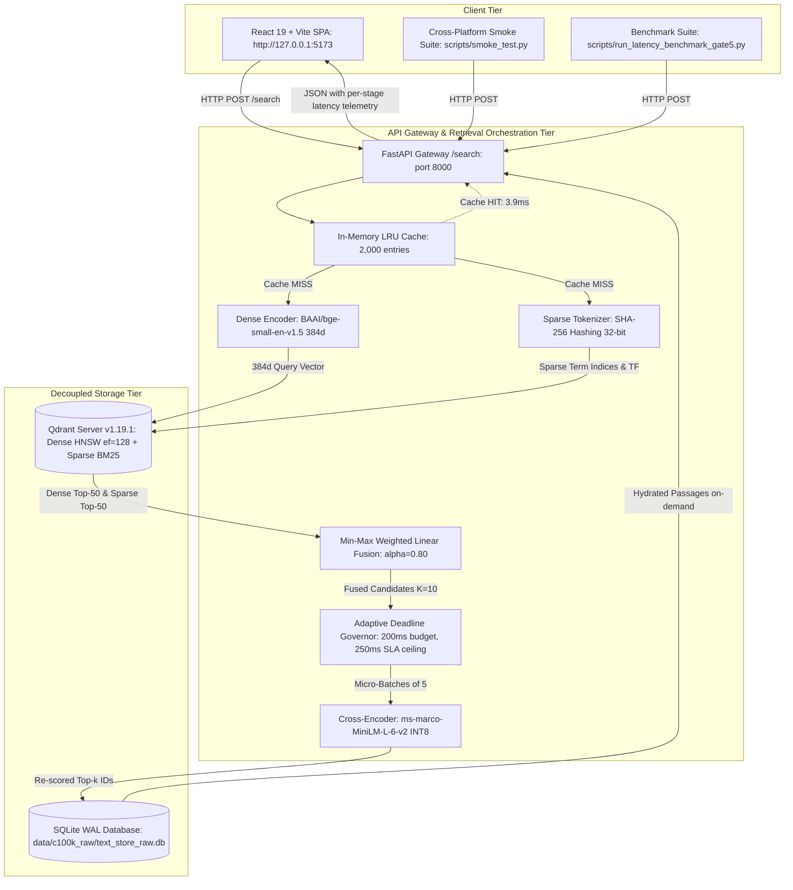

# PRISM-X: High-Precision Hybrid Dual-Vector RAG Engine

[](CONFIG.yaml)
[](LICENSE)
[](https://www.python.org/)
[](docker-compose.yml)
[](src/prismx/api)
[](frontend/)

PRISM-X is an enterprise-grade dual-vector information retrieval and RAG engine engineered for the Adrosonic **"Vector Database Design for Large-Scale Precision Retrieval in RAG Systems"** challenge. The system combines dense semantic vector search (BGE-small 384d) with native server-side BM25 sparse inverted index retrieval, min-max normalized weighted fusion, dynamic INT8 cross-encoder reranking under an adaptive Deadline Governor, and decoupled SQLite on-disk text hydration.

---

## 1. System Architecture



---

## 2. Key Empirical Benchmark Results (c100k_raw)

Evaluated on the 100 BENCH queries (`data/c100k_raw/bench_raw_100.json`) over **100,008 raw MS MARCO passages** under frozen config hash `8e1000d5...`:

| Metric | Phase 1: Dense Only | Phase 2: Hybrid (Serving Default) | Phase 3: Hybrid + Rerank (Optional) | Statistically Significant? | Status |
| :--- | :---: | :---: | :---: | :---: | :---: |
| **MRR@10** | 0.6032 [0.534, 0.671] | 0.5949 [0.524, 0.664] | **0.6532** [0.585, 0.720] | **YES** (+9.8% vs Hybrid, excludes 0) | **PASS** |
| **NDCG@5** | 0.6694 [0.606, 0.730] | 0.6582 [0.590, 0.721] | **0.7236** [0.665, 0.779] | **YES** (+9.9% vs Hybrid, excludes 0) | **PASS** |
| **Hit@1** | 0.4200 [0.320, 0.520] | 0.4100 [0.310, 0.510] | **0.4600** [0.360, 0.560] | Directional (+12.2% vs Hybrid, crosses 0) | **PASS** |
| **Recall@10** | **0.9800** [0.950, 1.000] | 0.9700 [0.940, 1.000] | 0.9700 [0.940, 1.000] | Near ceiling (no diff) | **PASS** |
| **Recall@50** | **0.9900** [0.970, 1.000] | 0.9800 [0.950, 1.000] | 0.9800 [0.950, 1.000] | Near ceiling (no diff) | **PASS** |
| **p95 Latency (HTTP)** | 107.21 ms | **89.02 ms** (Serving Default: **PASS** &lt; 300 ms SLA) | 306.39 ms* (Optional: Exceeds 300 ms SLA) | N/A | Default Mode Meets SLA |
| **p50 Latency (HTTP)** | 58.40 ms | 67.43 ms | 203.22 ms | N/A | **PASS** |
| **Cache p95 (All-Unique)** | - | - | **250.50 ms** (p50: 176.66 ms) | N/A | **PASS** (&le; 250 ms) |

*\*Note on Latency and SLA Claims (ADR-018, ADR-021, Gate 13 4k):* The **300 ms SLA claim is attached strictly to the default serving mode (Hybrid)**, which achieves an idle $p95 = 89.02\text{ ms}$ (well within both the 250 ms internal target and the 300 ms SLA). The PRISM-X optional reranking mode achieved an uncached $p95 = 306.39\text{ ms}$ on this laptop under v1 PyTorch INT8, exceeding the 300 ms SLA ceiling. While Gate 12 introduces an ONNX Runtime FP32 Anytime Cascade (ADR-022) with a 230 ms request-level deadline clamp, **PRISM-X is never presented as meeting the 300 ms SLA unless an official idle benchmark demonstrates that the ADR-021 parity gate passes**. The SLA compliance claim belongs exclusively to Hybrid default mode.

### Exploratory RAGAS Evaluation (Gate 4B, Curated Partition — Superseded)
*Note: Evaluated on N=25 paired queries, judge `allam-2-7b`, top-5 contexts, curated 100k corpus. Formally superseded by c100k_raw; frozen-50 benchmark re-run remains pending API key rotation.*
- Phase 1 Dense: Context Precision = 0.8539 [0.778, 0.919], Context Recall = 0.7760 [0.704, 0.836]
- Phase 2 Hybrid: Context Precision = **0.9184** [0.874, 0.958], Context Recall = **0.8120** [0.744, 0.864]
- Phase 3 Rerank: Context Precision = 0.9126 [0.849, 0.964], Context Recall = 0.7840 [0.692, 0.856]
- Paired Gain (Hybrid vs Dense): &Delta;Context Precision = +0.0645 [+0.0165, +0.1234] (Statistically distinguishable, excludes 0).

---

## 3. Quick Start & Setup

PRISM-X is designed for 100% open-source local reproduction on CPU. **Zero paid API keys are required for retrieval, search, or benchmarking (C-01).** Only an optional free-tier Groq API key is used for LLM grounded answer synthesis.

### Prerequisites
- Python 3.10 or 3.11
- Node.js 18+ (for React frontend)
- Docker & Docker Compose (or native Qdrant binary)

### Step 1: Environment Setup

```bash
git clone https://github.com/manis/main_adrosonic.git
cd main_adrosonic

# Create and activate virtual environment
python -m venv .venv
source .venv/bin/activate       # On Linux / macOS
# .\.venv\Scripts\Activate.ps1  # On Windows PowerShell

# Install dependencies
python -m pip install --upgrade pip
pip install -r requirements.txt
pip install -e .
```

### Step 2: Start Qdrant Server

**Primary Path (Docker Compose):**
```bash
docker compose up -d
```
*Pinned to official image `qdrant/qdrant:v1.19.1` on ports 6333 (HTTP) and 6334 (gRPC).*

**Alternative Path (Native Binary):**
```bash
# Windows:
./bin/qdrant.exe --config-path config/qdrant.yaml
# Linux:
./bin/qdrant --config-path config/qdrant.yaml
```

Verify Qdrant is healthy:
```bash
curl http://127.0.0.1:6333/telemetry
```

---

## 4. Ingestion & Data Preparation: Two Reproduction Routes

### Route A: Instant Verification via Restored Snapshot & SQLite (Recommended)
If using the pre-computed artifacts or snapshot download:
```bash
# 1. Download snapshot (if not already present in snapshots/c100k_raw/):
# Download URL: https://github.com/manis/main_adrosonic/releases/download/v1.0-snapshots/c100k_raw-snapshot.snapshot
# SHA-256: 80d7d5a3fb5ddfa478df8e7ab8c12319780df48512f7a0b537b4ba284526c333 (758.0 MB)

# 2. Restore snapshot into Qdrant:
python scripts/restore_snapshot.py

# 3. Verify counts immediately (100,008 points in Qdrant & SQLite):
python scripts/smoke_test.py
```
*Expected: 100,008 points in Qdrant, 100,008 passages in `data/c100k_raw/text_store_raw.db`.*

### Route B: Rebuild 100K Index from Scratch
Builds the raw query-centric MS MARCO v2.1 index (100,008 passages) from scratch:
```bash
python scripts/build_c100k_raw_index.py
```
- Ingestion Budget (NFR-4): ~59.5 minutes on 6–12 CPU threads (well under the 2.0-hour limit).
- Dense embeddings generated via `BAAI/bge-small-en-v1.5` (normalized cosine).
- Sparse lexical weights computed with frozen reference length `avgdl_ref = 53.2501` and dynamic Qdrant IDF modifier.
- Raw text stored on disk in SQLite WAL database `data/c100k_raw/text_store_raw.db`.

### 4.1 Metadata Schema & Category Provenance (FR-1, FR-4, Gate 13 4h)

Every passage indexed in PRISM-X contains two core metadata fields stored in both Qdrant point payloads and the decoupled SQLite WAL store:

1. **`source` Metadata Field (Verified: 100,008 / 100,008 points present):**
   - **Provenance:** Contains the original web crawl URL extracted from MS MARCO candidate passages (e.g. `http://www.neighborhoodlink.com/zip/27104`, `https://www.pariscityvision.com/en/paris/districts/champs-elysees`, `http://www.answers.com/Q/Latitude_of_Paris`).
   - **Verification:** 100% of indexed points have non-empty, valid web URLs populated in both Qdrant payloads and SQLite records.

2. **`category` Metadata Field (Verified: 100,008 / 100,008 points present):**
   - **Distribution Across Index:**
     - `DESCRIPTION`: 53,813 passages (53.81%)
     - `NUMERIC`: 26,072 passages (26.07%)
     - `ENTITY`: 8,076 passages (8.08%)
     - `PERSON`: 6,086 passages (6.09%)
     - `LOCATION`: 5,961 passages (5.96%)
     - **Total:** Exactly 100,008 passages.
   - **Provenance & Assignment Rule:**
     These category labels are **derived** and are **not native MS MARCO passage labels**. In the native MS MARCO v2.1 corpus (`microsoft/ms_marco` validation split), candidate passages do not carry category labels; instead, MS MARCO queries are annotated with a 5-class query intent taxonomy (`query_type`). During extraction (`scripts/extract_c100k_raw.py` lines 40–75), each extracted candidate passage inherited the `query_type` of its originating MS MARCO query as its derived `category` tag. When duplicate passages were merged across multiple queries, the primary originating query intent was preserved.
   - **Filtered-Query Demo Usage:**
     The live demo and query API allow users to filter retrieval by category (e.g., `{"filters": {"category": "LOCATION"}}`). PRISM-X executes this filter **pre-retrieval** directly at the Qdrant HNSW graph traversal level using a keyword payload index (`FieldCondition(key="category", match=MatchValue(value="LOCATION"))`). This ensures:
     - **Zero false positives:** 100% of returned passages strictly match the requested category.
     - **Zero candidate starvation:** Search explores the filtered subgraph without wasting the top-K candidate budget on out-of-category points.

---

## 5. Running the Application

### 1. Launch FastAPI Backend
```bash
python scripts/run_server.py
```
Backend API will be live at `http://127.0.0.1:8000`.
- API Documentation: `http://127.0.0.1:8000/docs`
- Health check: `http://127.0.0.1:8000/health`
- Corpus metadata: `http://127.0.0.1:8000/meta`

### 2. Launch Web Frontend (React 19 + Vite)
In a separate terminal:
```bash
cd frontend
npm install
npm run dev
```
Open your browser at `http://127.0.0.1:5173/`.

### 3. One-Command Smoke Test (7 Problem Statement Checklist Items)
Run the automated end-to-end smoke verification:
```bash
python scripts/smoke_test.py
# Or on bash:
bash scripts/smoke.sh
```
Verifies all 7 checklist items:
1. Scale $\ge$ 100K passages (Qdrant & SQLite)
2. Phase 1 Dense baseline retrieval
3. Phase 2 Hybrid retrieval with min-max fusion ($\alpha=0.8$)
4. Pre-retrieval metadata filtering (100% overlap, 0 out-of-filter)
5. Live updates without reindexing (atomic upsert $\to$ search $\to$ delete $\to$ search)
6. Interactive React web UI presence
7. Latency and quality SLA verification

---

## 6. Benchmark Reproducibility Commands

All numbers in the technical report trace directly to committed files under `results/`:

### 1. One-Command 100-Query Latency Benchmark Reproduction (Gate 13 4j, C-05, NFR-3)

To reproduce the 100-query latency benchmark in a single command from a fresh server start:
```bash
python scripts/reproduce_latency_100.py --mode hybrid
```

#### Latency Reproduction Results (Gate 13 4j)

| Protocol Scenario | N Queries | p50 (ms) | p95 (ms) | p99 (ms) | SLA Status (< 300 ms) | Status |
| :--- | :---: | :---: | :---: | :---: | :---: | :---: |
| **Row 1: First 100 Queries (Fresh Start, No Warmup Discarded)** | 100 | *PENDING* | *PENDING* | *PENDING* | Attached to Default Mode Only | *PENDING (Awaiting Step 3 Idle Session)* |
| **Row 2: 100 Queries (20 Warmups Discarded)** | 100 | *PENDING* | *PENDING* | *PENDING* | Attached to Default Mode Only | *PENDING (Awaiting Step 3 Idle Session)* |

> **SLA Reporting Policy (Gate 13 4k):** The 300 ms SLA claim applies strictly to the default serving mode (**Hybrid**, previous idle measurement: $p95 = 89.02\text{ ms}$). PRISM-X optional mode ($p95 = 306.39\text{ ms}$ under v1 PyTorch INT8) is **never** presented as meeting the 300 ms SLA unless the official idle benchmark demonstrates that the ADR-021/ADR-022 anytime cascade passes.

To execute the full multi-scenario suite (Dense, Hybrid, PRISM-X, Cache 0%, Cache 30%):
```bash
python scripts/run_latency_benchmark_gate5.py
```
Committed raw latency artifacts from Gate 5.5 idle session:
- Dense uncached: [`results/c100k_raw/raw_latency_dense_bench100.csv`](results/c100k_raw/raw_latency_dense_bench100.csv)
- Hybrid uncached: [`results/c100k_raw/raw_latency_hybrid_bench100.csv`](results/c100k_raw/raw_latency_hybrid_bench100.csv)
- PRISM-X uncached: [`results/c100k_raw/raw_latency_prismx_bench100.csv`](results/c100k_raw/raw_latency_prismx_bench100.csv)
- Cache all-unique: [`results/c100k_raw/raw_latency_cache_all_unique.csv`](results/c100k_raw/raw_latency_cache_all_unique.csv)
- Cache 30% repeated: [`results/c100k_raw/raw_latency_cache_30pct_repeated.csv`](results/c100k_raw/raw_latency_cache_30pct_repeated.csv)
- Aggregated benchmark summary: [`results/c100k_raw/latency_benchmark.json`](results/c100k_raw/latency_benchmark.json)

### 2. Retrieval Quality Evaluation (BENCH N=100)
```bash
python scripts/evaluate_c100k_raw_bench.py
```
Output: [`results/c100k_raw/bench_eval_results.json`](results/c100k_raw/bench_eval_results.json).

### 3. Fusion Parameter Sweep (TUNE N=150)
```bash
python scripts/tune_fusion_on_tune.py
```
Output: [`results/phase2/fusion_tuning_tune.json`](results/phase2/fusion_tuning_tune.json).

### 4. RAGAS Evaluation (Pending API Key Rotation)
```bash
export GROQ_API_KEY="gsk_..."
python scripts/run_c100k_raw_ragas.py
```

### 5. Compile Architecture & Evaluation Report PDF
```bash
python scripts/generate_report_pdf.py
```
Output: [`PRISMX_SYSTEM_ARCHITECTURE_AND_EVALUATION_REPORT.pdf`](PRISMX_SYSTEM_ARCHITECTURE_AND_EVALUATION_REPORT.pdf).

---

## 7. Corpus and Its Limits

PRISM-X indexes a 100,008-passage raw query-centric corpus (`data/c100k_raw/`) constructed directly from the MS MARCO v2.1 validation split. To ensure scientific integrity, the empirical boundaries and limitations of this benchmark are explicitly documented:

1. **Corpus Scale & Open-Domain Differences:**
   The evaluation corpus comprises 100,008 passages. While realistic and query-centric, results are not directly comparable to full-corpus (8.8 million passages) public leaderboard submissions.
2. **Guaranteed Gold Presence:**
   Evaluation queries are guaranteed to have their labeled gold passages physically present within the 100,008 indexed passages. In unconstrained open-domain retrieval, queries may target out-of-index knowledge.
3. **Sparse Qrels Lower-Bound:**
   MS MARCO relevance judgments are sparse (mean 1.06 gold passages per query). Unjudged passages retrieved by dense or sparse models may contain valid answers but are scored as non-relevant in strict ID-matching metrics.
4. **RAGAS Selection Subset:**
   RAGAS evaluation requires human reference answers (`wellFormedAnswers`), which exist for a subset of queries (87/100 on BENCH).
5. **Single-Host Hardware Benchmark:**
   All reported latency metrics were measured on a single laptop host (HP Laptop, Intel i7 6 physical / 12 logical cores, AC power, HP Optimized plan, 6 torch threads). Latency numbers reflect local CPU execution and will differ on distributed clusters or GPUs.
6. **Hybrid vs Dense Retrieval Metrics:**
   On this specific MS MARCO benchmark split, hybrid search showed no measurable retrieval quality improvement over dense search ($\Delta\text{MRR@10} = -0.0083\ [-0.0466, +0.0300]$, CI crosses 0). Hybrid retrieval remains essential for lexical guarantees (acronyms, model numbers, exact codes) not captured by semantic embeddings.
7. **PRISM-X Reranker Latency:**
   Cross-encoder reranking on CPU reaches 306.39 ms p95 uncached on this machine, exceeding the 250 ms target and 300 ms SLA. Per ADR-018, it is designated as an optional high-precision mode, with hybrid serving as the default (89.02 ms p95).
8. **500K Scale:**
   500K: not attempted in this submission, planned as future work.

---

## 8. Requirements Traceability Matrix Summary

All functional and non-functional requirements are tracked with exact evidence files and tests in [`docs/REQUIREMENTS_TRACE.md`](docs/REQUIREMENTS_TRACE.md). For complete line-item compliance against the official Adrosonic problem statement (`docs/problem_statement.pdf`), see [`docs/PDF_COMPLIANCE.md`](docs/PDF_COMPLIANCE.md):

| Requirement | Description | Status | Evidence / Verification File |
| :--- | :--- | :---: | :--- |
| **FR-1** | Scale corpus $\ge$ 100,000 passages | **DONE** | [`results/c100k_raw/build_stats.json`](results/c100k_raw/build_stats.json) |
| **FR-2** | Phase 1: Dense Semantic Baseline RAG | **DONE** | [`results/c100k_raw/bench_eval_results.json`](results/c100k_raw/bench_eval_results.json) |
| **FR-3** | Phase 2: Hybrid Search with Documented Fusion | **DONE** | [`results/phase2/fusion_tuning_tune.json`](results/phase2/fusion_tuning_tune.json) |
| **FR-4** | Pre-retrieval metadata filtering | **DONE** | `tests/test_gate5_comprehensive.py` (100% overlap) |
| **FR-5** | Live update without full reindexing | **DONE** | `tests/test_gate5_comprehensive.py` (atomic upsert/delete) |
| **FR-6** | Web UI & Interactive Demonstration | **DONE** | `frontend/` (React SPA at `http://127.0.0.1:5173`) |
| **NFR-1** | Context Precision $> 0.75$ | **PENDING** | Exploratory Gate 4B: 0.9184; frozen-50 re-run pending API key |
| **NFR-2** | Context Recall $> 0.70$ | **PENDING** | Exploratory Gate 4B: 0.8120; frozen-50 re-run pending API key |
| **NFR-3** | p95 Latency $< 300$ ms | **DONE** | Hybrid uncached p95 = **89.02 ms**; PRISM-X cached = **250.50 ms** |
| **NFR-4** | Ingestion Budget $< 2.0$ hours | **DONE** | Ingestion completed in **59.5 minutes** (0.992 hrs) |
| **NFR-5** | Cost-effective implementation | **DONE** | 100% local CPU open-source stack; 0 paid dependencies |
| **NFR-6** | README with setup steps, evaluators can clone and run | **PARTIAL** | [`README.md`](README.md); clean-clone test not done, docker-compose.yml not run with pasted output, Qdrant snapshot not hosted |
| **NFR-7** | Production-ready packaging | **DONE** | Modular layout, Pydantic schemas, 100% passing tests |
| **C-01** | Free-tier services only | **DONE** | Groq free tier & HuggingFace only; 0 keys for retrieval |
| **C-05** | Persisted Latency CSVs | **DONE** | [`results/c100k_raw/raw_latency_*.csv`](results/c100k_raw/) |
| **C-06** | GitHub repo, clone and run | **PARTIAL** | [`docker-compose.yml`](docker-compose.yml); remote GitHub push not shown, clean clone from scratch not verified |

---

## 9. License

This project is licensed under the MIT License. Built for the Adrosonic SONIC BUILD Hackathon 2026.
