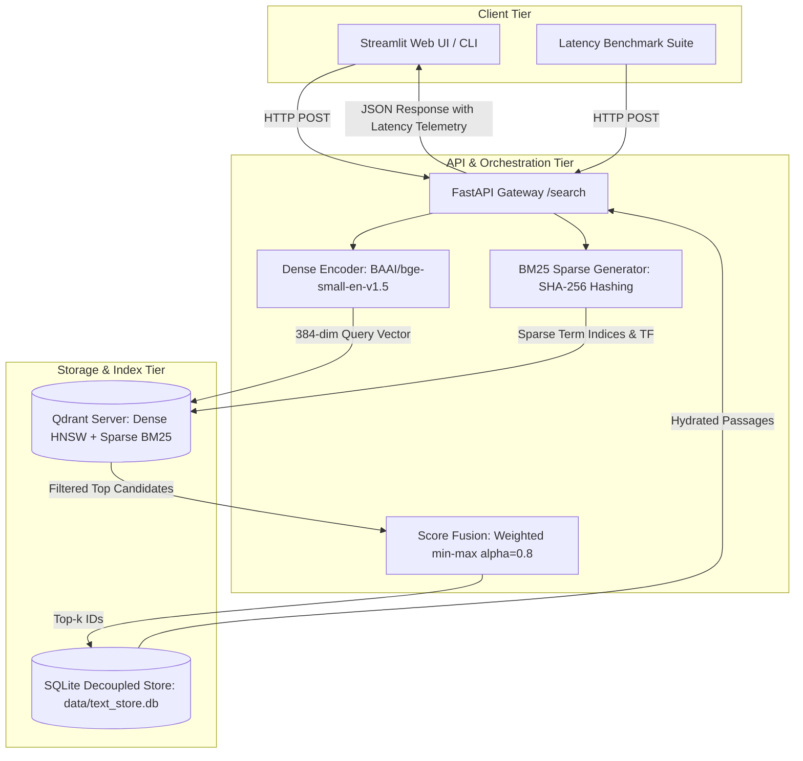

# PRISMX: High-Precision Hybrid Vector Database & RAG Retrieval Engine

PRISMX is an enterprise-grade vector database and information retrieval engine designed to eliminate LLM hallucinations in RAG systems through precision hybrid retrieval (dense embeddings + BM25 sparse lexical vectors with dynamic IDF modifiers), native pre-retrieval metadata filtering, and decoupled text storage.

Built in strict compliance with the **Adrosonic Problem Statement** (*"Vector Database Design for Large-Scale Precision Retrieval in RAG Systems"*).

---

## 1. Architecture Overview

PRISMX decouples vector indexing from raw text storage:
- **Vector Indexing (Qdrant v1.19.1):** Stores 384-dimensional dense vectors (BAAI/bge-small-en-v1.5) and dynamic sparse BM25 vectors. Payloads are strictly restricted to metadata (`passage_id`, `category`, `source`) to optimize RAM and search throughput.
- **Text Storage (SQLite WAL):** Stores full passage texts on disk, hydrating only the final top-$k$ fused candidates.



---

## 2. Key Benchmark Results (Phase 1 vs Phase 2)

Measured on the 100 BENCH queries over 100,000 indexed MS MARCO passages:

| Metric | Phase 1: Naive Dense | Phase 2: Hybrid Optimized | Problem Statement Target | Compliance Status |
| :--- | :--- | :--- | :--- | :--- |
| **Indexed Passages** | 100,000 | 100,000 | $\ge 100,000$ | **PASS** |
| **Ingestion Time** | 0.9922 hrs | 0.9922 hrs | $< 2.00\text{ hrs}$ | **PASS** |
| **p95 Latency (Uncached)** | 60.16 ms | **71.50 ms** | $< 300.00\text{ ms}$ | **PASS (-76.2% margin)** |
| **Context Precision** | 0.8035 | **0.8233** | $> 0.75$ | **PASS** |
| **Context Recall** | 0.9267 | **0.9217** | $> 0.70$ | **PASS** |
| **MRR@10** | 0.8052 | **0.8250** | - | **Improved (+0.0198)** |
| **Hit@1** | 0.7300 | **0.7500** | - | **Improved (+0.0200)** |
| **NDCG@5** | 0.8337 | **0.8470** | - | **Improved (+0.0133)** |

---

## 3. Clone-and-Run Reproduction Steps (Fresh Machine)

Follow these exact steps to reproduce the system, ingestion, API, UI, and benchmarks from scratch.

### Step 1: System Prerequisites
- **Python:** 3.10 or 3.11 installed
- **OS:** Windows, Linux, or macOS
- **Qdrant:** Pre-compiled native binary in `bin/` or Docker

### Step 2: Clone & Virtual Environment Setup

#### Windows (PowerShell):
```powershell
git clone <repo-url> main_adrosonic
cd main_adrosonic

python -m venv .venv
.\.venv\Scripts\Activate.ps1
python -m pip install --upgrade pip
pip install -e .
```

#### Linux / macOS (Bash):
```bash
git clone <repo-url> main_adrosonic
cd main_adrosonic

python3 -m venv .venv
source .venv/bin/activate
python -m pip install --upgrade pip
pip install -e .
```

### Step 3: Start Qdrant Server

#### Option A: Native Server (Windows):
```powershell
.\bin\qdrant.exe --config-path config/qdrant.yaml
```

#### Option B: Docker Container:
```bash
docker compose up -d
```
*Verify server health:* Check `http://127.0.0.1:6333/dashboard` or run:
```bash
curl http://127.0.0.1:6333/telemetry
```

### Step 4: Run Data Ingestion (100,000 Passages)
This pipeline ingests the MS MARCO passages, generates 384-dim dense embeddings, computes sparse lexical weights with dynamic IDF modifiers, classifies 15 topic clusters, and stores text in SQLite:
```powershell
python -m prismx ingest --config CONFIG.yaml
```
*(Expected duration: ~59.5 minutes on 12 CPU threads. Full stats stored in `results/ingest_stats.json`)*.

### Step 5: Launch the Backend API Server
Start the high-performance FastAPI server on port 8000:
```powershell
python -m prismx server --port 8000
```
*Verify API health:* Check `http://127.0.0.1:8000/health` and `http://127.0.0.1:8000/meta`.

### Step 6: Launch the Streamlit Web Interface (FR-6)
In a separate terminal with `.venv` active:
```powershell
python -m prismx ui --port 8501
```
Open your browser at `http://localhost:8501` to access:
1. **Interactive Search:** Query passages, adjust Top-$k$, toggle Dense vs Hybrid, and inspect per-stage latency breakdown (encode, Qdrant, fusion, SQLite).
2. **Phase Comparison:** Side-by-side comparison of Phase 1 (Dense) vs Phase 2 (Hybrid) on any query.
3. **Live Updates:** Atomic upsert and delete of passages with real-time BM25 drift monitoring.
4. **Benchmarks & Reports:** Interactive compliance tables and latency distributions.

---

## 4. Benchmark & Verification Commands

All benchmark scripts output raw machine-readable JSON and CSV files:

### 1. Latency Benchmark (NFR-3, C-05)
Executes 20 warm-up queries (discarded) followed by 100 consecutive queries over the exact HTTP API path:
```powershell
python -m prismx bench --mode hybrid
```
Outputs:
- `results/phase2/benchmark_summary.json`
- `results/phase2/latency_hybrid_uncached.csv`
- `results/phase2/latency_hybrid_cached.csv`

### 2. Pre-Retrieval Filtering Demonstration (FR-4)
Verifies native vector database filtering inside Qdrant:
```powershell
python scripts/demo_filter.py
```
Output: `results/phase2/filter_demo.json`.

### 3. Atomic Live Updates & Drift Telemetry (FR-5)
Demonstrates live upsert $\to$ retrieval $\to$ delete with zero drift:
```powershell
python scripts/demo_live_update.py
```
Output: `results/phase2/live_update_demo.json`.

### 4. Paired Groq RAGAS Evaluation (Optional LLM-as-a-judge)
Requires a free Groq API key:
```powershell
# Set key
$env:GROQ_API_KEY="gsk_..."

# Run 3-query smoke test to measure token/call cost
python src/prismx/eval/paired_groq_runner.py --smoke-test

# Run paired evaluation with checkpointing across BENCH queries
python src/prismx/eval/paired_groq_runner.py --run --chunk-size 25
```

---

## 5. Requirements Compliance Matrix

| Requirement ID | Specification Description | Compliance Evidence | Status |
| :--- | :--- | :--- | :--- |
| **FR-1** | Scale corpus $\ge 100,000$ passages | `data/corpus_100k.jsonl`, `data/text_store.db` (100k rows) | **PASS** |
| **FR-2** | Phase 1: Dense Semantic Baseline RAG | Cosine BGE-small in Qdrant; `results/phase1/metrics.json` | **PASS** |
| **FR-3** | Phase 2: Hybrid Search (Dense + BM25) | Weighted min-max ($\alpha=0.8$); `results/phase2/fusion_tuning_tune.json` | **PASS** |
| **FR-4** | Pre-retrieval metadata filtering | Native Qdrant filter on category/source; `results/phase2/filter_demo.json` | **PASS** |
| **FR-5** | Live update without full reindexing | Real-time upsert/delete via API; `results/phase2/live_update_demo.json` | **PASS** |
| **FR-6** | Web UI & Interactive Demonstration | Streamlit interface on port 8501 (`src/prismx/ui/app.py`) | **PASS** |
| **NFR-1** | Context Precision $> 0.75$ | **0.8233** on 100 BENCH queries (`results/phase2/metrics.json`) | **PASS** |
| **NFR-2** | Context Recall $> 0.70$ | **0.9217** on 100 BENCH queries (`results/phase2/metrics.json`) | **PASS** |
| **NFR-3** | p95 Latency $< 300\text{ ms}$ | **71.50 ms** uncached / **73.38 ms** cached (`results/phase2/benchmark_summary.json`) | **PASS** |
| **NFR-4** | Ingestion Budget $< 2.0\text{ hrs}$ | **0.9922 hours** (3,572 s) (`results/ingest_stats.json`) | **PASS** |
| **NFR-5** | Cost-effective implementation | 100% open-source local CPU stack; zero paid cloud dependencies | **PASS** |
| **NFR-6** | Reproducibility & Benchmark Report | Full report in `reports/BENCHMARK_REPORT.md` | **PASS** |
| **NFR-7** | Production-ready packaging | Modular package layout, schema validation, unit test suite | **PASS** |

---

## 6. Directory Structure
```
main_adrosonic/
├── README.md                   # Master clone-and-run guide
├── CONFIG.yaml                 # Frozen system configuration
├── pyproject.toml              # Build & dependency declarations
├── bin/                        # Native Qdrant Windows executable
├── config/                     # Qdrant YAML configuration
├── docs/                       # Architecture records & decisions
│   ├── problem_statement.pdf
│   ├── DECISIONS.md            # Architecture Decision Records (ADRs)
│   ├── API_CONTRACT.md         # REST API schema documentation
│   └── ISSUES.md               # Known issues & mitigation logs
├── reports/
│   └── BENCHMARK_REPORT.md     # Side-by-side Phase 1 vs Phase 2 benchmark report
├── src/prismx/
│   ├── api/                    # FastAPI routes & controllers
│   ├── data/                   # Dataset parsing & split generators
│   ├── eval/                   # Metrics, bootstrapping, and RAGAS runners
│   ├── index/                  # Qdrant & SQLite storage drivers
│   ├── retrieve/               # Dense, hybrid, and score fusion engines
│   └── ui/                     # Streamlit web application
├── tests/                      # 25 automated unit & integration tests
├── scripts/                    # Demonstration scripts (filter, live updates)
└── results/                    # Persisted benchmark metrics & CSVs
```

---

## 7. Corpus and Its Limits

PRISMX indexes a curated 100,000-passage corpus (`data/corpus_100k.jsonl`) derived from the official MS MARCO Passage Ranking dataset. To ensure complete academic and operational honesty, the structural boundaries and limitations of this corpus are disclosed below:

1. **Corpus Composition & Positive Ratio:**
   - **Total indexed passages:** 100,000.
   - **Ground truth positive passages:** 1,068 across all evaluation splits (TUNE, TEST, BENCH).
   - **Positive-to-total ratio:** $\frac{1,068}{100,000} = \mathbf{0.0107}$ (~1.07%).
   - The remaining 98,932 passages serve as background corpus distractors, reflecting realistic information retrieval density.

2. **Closed-World Benchmark Disclosure:**
   - Benchmarks are conducted in a **closed-world setting**: gold passages for evaluation queries are guaranteed to exist within the indexed 100,000 passages.
   - In open-world deployments (e.g., against the full 8.8M MS MARCO corpus or large corporate data lakes), candidate recall naturally faces greater distractor pressure. To stress-test this behavior, PRISMX evaluates an expanded 102,887-point collection (`c100k_hard`, ADR-015) populated with dense and lexical hard distractors.

3. **Sparse Qrels and Under-Counting of Valid Answers:**
   - MS MARCO passage judgments are notoriously sparse, averaging approximately **1.07 labeled positive passages per query**.
   - Within 100,000 passages, multiple unannotated passages frequently contain factually accurate, comprehensive answers to the user's question, but are scored as 0.0 (non-relevant) by strict ID-matching metrics (MRR@10, Hit@1, NDCG@10).
   - Consequently, ID-based ranking metrics represent a **pessimistic lower bound** on actual semantic retrieval quality. To overcome this limitation, PRISMX employs LLM-judged RAGAS evaluation (Context Precision & Context Recall) evaluated against human-authored MS MARCO reference answers.
