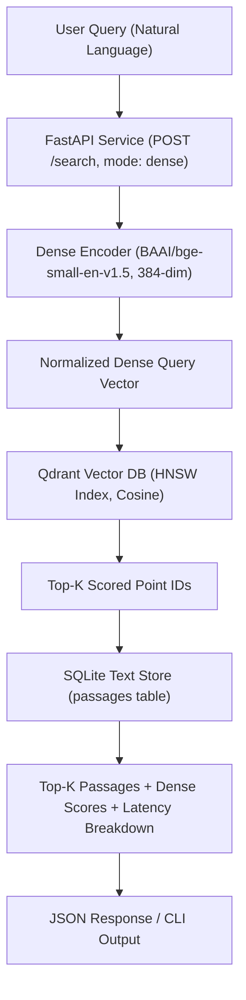
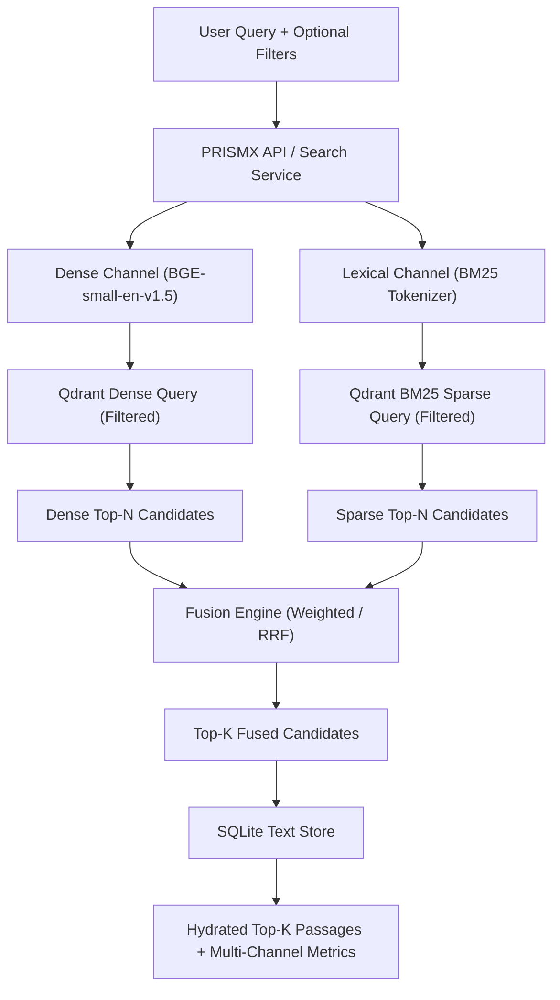

# PRISMX Architecture Specification

This document details the system architecture of the PRISMX Vector Database and Retrieval Engine.

---

## 1. System Overview

PRISMX is an enterprise-grade retrieval pipeline engineered to solve LLM hallucination by combining dense semantic retrieval with sparse lexical retrieval (BM25 with server-side IDF modifiers) and pre-retrieval metadata filtering.

The system is decoupled into two tiers:
1. **Vector & Filter Tier (Qdrant Server):** Houses the 384-dimensional dense vectors (HNSW index) and sparse lexical term vectors with IDF modifiers, along with keyword payload indexes on metadata attributes (`category`, `source`).
2. **Document & State Tier (SQLite):** Houses the raw passage texts, cluster metadata, and persistent index state statistics (`avgdl`, `index_version`). Full text payloads are retrieved only for the final top-$k$ results.

---

## 2. Phase 1 Architecture: Dense Baseline RAG

In Phase 1, incoming natural language queries are transformed into dense embeddings via `BAAI/bge-small-en-v1.5` and matched against the Qdrant HNSW index using cosine similarity. Top-$k$ passage IDs are resolved against SQLite to return hydrated passages with scores and per-stage latency timings.

---

## 3. Phase 2 Architecture: Hybrid Search, Filtering, and Live Updates (Preview)

In Phase 2, the pipeline is upgraded to dual-channel retrieval:
1. **Dense Channel:** HNSW semantic search.
2. **Lexical Channel:** BM25 sparse vector search with inverse document frequency (IDF) modifier in Qdrant.
3. **Pre-Retrieval Filtering:** Metadata constraints (`category`, `source`) pushed directly into Qdrant index scan filters before scoring.
4. **Client-Side Fusion:** Reciprocal Rank Fusion (RRF) or Min-Max Normalized Weighted Combination.
5. **Live Updates:** Atomic upsert and delete operations across Qdrant and SQLite without reindexing.

