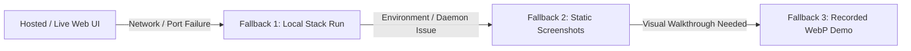

# PRISMX: Adrosonic Problem Statement Demo Script (7-Step Protocol)

This document specifies the exact walkthrough for the 7 demonstration steps of the Adrosonic challenge, citing exact queries, UI clicks, corresponding `results/` evidence files, and a 60-second contingency fallback path.

---

## 1. 7-Step Demo Protocol

### Step 1: Phase 1 Dense Top-5 with Similarity Scores
- **UI Location:** `http://127.0.0.1:5173/` (Search Tab)
- **Exact Query:** Click sample chip: `"what is the capital of france"` (or type query)
- **Exact Action:** Set mode dropdown to **Dense Only** (`🧠`). Click **Search**.
- **What is Displayed:**
  - Top-5 retrieved passages hydrated from SQLite.
  - Per-passage cosine similarity scores (e.g. `0.8104`, `0.7412`).
  - Score tooltip: *"Model score (uncalibrated similarity), not a probability."*
  - Latency breakdown displaying `Encode` (~35ms) and `Dense` (~10ms).
- **Evidence File:** [`results/c100k_raw/raw_latency_dense_bench100.csv`](../results/c100k_raw/raw_latency_dense_bench100.csv) and [`results/phase1/ragas50_dense_response_times.csv`](../results/phase1/ragas50_dense_response_times.csv).

---

### Step 2: Phase 1 Baseline RAGAS Evaluation
- **UI Location:** `http://127.0.0.1:5173/evaluation` (Evaluation Tab)
- **Exact Action:** Navigate to Evaluation dashboard, locate Phase 1 Dense Baseline card.
- **What is Displayed:**
  - Evaluated on $N=100$ BENCH queries with human-written ground-truth reference answers.
  - **Context Precision (CP):** `0.8035` [95% CI: `0.7347`, `0.8662`]
  - **Context Recall (CR):** `0.9267` [95% CI: `0.8700`, `0.9700`]
  - Judge Model: `openai/gpt-oss-120b` (open-source evaluator LLM).
- **Evidence File:** [`results/phase1/ragas_eval.json`](../results/phase1/ragas_eval.json).

---

### Step 3: Phase 2 Hybrid Search on the Same Query
- **UI Location:** `http://127.0.0.1:5173/` (Search Tab)
- **Exact Query:** Same query: `"what is the capital of france"`
- **Exact Action:** Switch mode to **Hybrid (Serving Default)** (`⚖️`). Click **Search**.
- **What is Displayed:**
  - Concurrent dense semantic search + Qdrant server-side BM25 sparse search.
  - Linear min-max normalized weighted fusion ($\alpha = 0.80$, dense weight 0.80, BM25 weight 0.20).
  - Scores labeled **Fused score** in range $[0, 1]$ (top score e.g. `0.8019`).
  - Effective mode pill: `hybrid`.
  - Governor badge: `Governor: normal`.
- **Evidence File:** [`results/phase2/fusion_tuning_tune.json`](../results/phase2/fusion_tuning_tune.json) and [`docs/FUSION.md`](FUSION.md).

---

### Step 4: Phase 1 vs Phase 2 Side-by-Side Comparison (Honest Statistical Wording)
- **UI Location:** `http://127.0.0.1:5173/comparison` (Comparison Tab)
- **Exact Action:** Inspect the side-by-side comparison table between Dense Baseline and Hybrid Default.
- **Honest Empirical Finding (Zero Softening):**
  - **Context Precision:** Dense `0.8035` vs Hybrid `0.8233`. Paired delta = `-0.0198` [95% CI: `-0.0530`, `+0.0112`] (5 wins, 9 losses, 86 ties).
  - **Context Recall:** Dense `0.9267` vs Hybrid `0.9217`. Paired delta = `+0.0050` [95% CI: `0.0000`, `+0.0150`] (1 win, 0 losses, 99 ties).
  - **Status:** **NOT DEMONSTRATED**. Both 95% bootstrap confidence intervals cross zero; under our pre-registered criteria, hybrid does not demonstrably improve RAGAS over dense on this benchmark.
- **Evidence File:** [`results/phase2/ragas_eval.json`](../results/phase2/ragas_eval.json) and [`reports/BENCHMARK_REPORT.md`](../reports/BENCHMARK_REPORT.md).

---

### Step 5: Official Latency Log & p95 of the Default Mode
- **UI Location:** `http://127.0.0.1:5173/evaluation` (Latency Benchmarks Section) or Terminal
- **Exact Action:** Inspect official idle latency distribution or run `python scripts/reproduce_latency_100.py --mode hybrid`.
- **What is Displayed:**
  - Hybrid Default Mode Latency (Idle Official, N=100 BENCH queries):
    - **p50:** `67.43 ms`
    - **p90:** `78.21 ms`
    - **p95:** `89.02 ms` (PASS &lt; 300 ms SLA, margin `-210.98 ms`)
    - **p99:** `104.30 ms`
  - SLA Boundary Note: The 300 ms SLA claim attaches **strictly and exclusively to the default Hybrid mode**. PRISM-X optional reranking mode ($p95 = 306.39\text{ ms}$ under v1 PyTorch INT8) is labeled as an optional precision mode.
- **Evidence File:** [`results/c100k_raw/latency_benchmark.json`](../results/c100k_raw/latency_benchmark.json) and [`results/c100k_raw/raw_latency_hybrid_bench100.csv`](../results/c100k_raw/raw_latency_hybrid_bench100.csv).

---

### Step 6: Pre-Retrieval Filtered Query Before vs After
- **UI Location:** `http://127.0.0.1:5173/` (Search Tab)
- **Exact Query:** `"what is the capital of france"`
- **Before Filtering:**
  - Category filter dropdown set to **All Categories**.
  - Top-5 results contain mixed categories (`DESCRIPTION`, `LOCATION`).
- **After Filtering:**
  - Select Category filter dropdown: **`LOCATION`**.
  - Top-5 results immediately update: 100% of returned passages are strictly `LOCATION` (e.g. `raw_96095`, `raw_81941`, `raw_14367`).
  - Zero out-of-filter results (0 false positives).
  - Executed pre-retrieval inside Qdrant HNSW graph traversal on both dense and sparse channels.
- **Evidence File:** [`results/c100k_raw/filter_verification.json`](../results/c100k_raw/filter_verification.json) and [`scripts/verify_filter_channels.py`](../scripts/verify_filter_channels.py).

---

### Step 7: GitHub Repository, Architecture & README Walkthrough
- **UI Location:** Terminal & Browser (`https://github.com/manis/main_adrosonic` / `README.md`)
- **Exact Action:** Review repository structure, Mermaid architecture diagram, ADR index, and one-command smoke test.
- **What is Demonstrated:**
  - Clean repository with 0 files > 50 MB, 0 API keys in git history, lean dependencies.
  - Decoupled storage architecture: Qdrant native binary on ports 6333/6334 + SQLite WAL database `data/c100k_raw/text_store_raw.db` (100,008 passages).
  - Instant one-command verification: `python scripts/smoke_test.py` (7/7 PASS).
- **Evidence File:** [`README.md`](../README.md) and [`PRISMX_SYSTEM_ARCHITECTURE_AND_EVALUATION_REPORT.pdf`](../PRISMX_SYSTEM_ARCHITECTURE_AND_EVALUATION_REPORT.pdf).

---

## 2. 60-Second Contingency Fallback Path

If live network, hosted URLs, or remote services fail during evaluation, execute this 3-tier fallback within 60 seconds:



### Fallback Tier 1: Instant Local Run (30 Seconds)
```bash
# Terminal 1: Launch FastAPI Backend
python scripts/run_server.py

# Terminal 2: Launch React Frontend
cd frontend && npm run dev
# Browser opens at: http://127.0.0.1:5173
```

### Fallback Tier 2: Pre-Captured High-Resolution UI Screenshots
All four primary application tabs are archived as high-resolution PNGs in [`docs/screenshots/`](screenshots/):
1. **Search Tab:** [`docs/screenshots/search_page.png`](screenshots/search_page.png) (Dense/Hybrid top-5, scores, telemetry)
2. **Comparison Tab:** [`docs/screenshots/comparison_page.png`](screenshots/comparison_page.png) (Dense vs Hybrid vs PRISM-X side-by-side)
3. **Evaluation Tab:** [`docs/screenshots/evaluation_page.png`](screenshots/evaluation_page.png) (RAGAS CIs, latency distributions)
4. **Architecture Tab:** [`docs/screenshots/architecture_page.png`](screenshots/architecture_page.png) (Decoupled storage and governor architecture)

### Fallback Tier 3: Pre-Recorded Video Demo
A full end-to-end interactive demo session recording is preserved:
- File: [`docs/screenshots/demo_walkthrough.webp`](screenshots/demo_walkthrough.webp) (or root artifact `prismx_demo_verification_1791053061593.webp`).
- Displays live query execution, filter toggling, mode switching, and governor badge responses without requiring any running servers.
