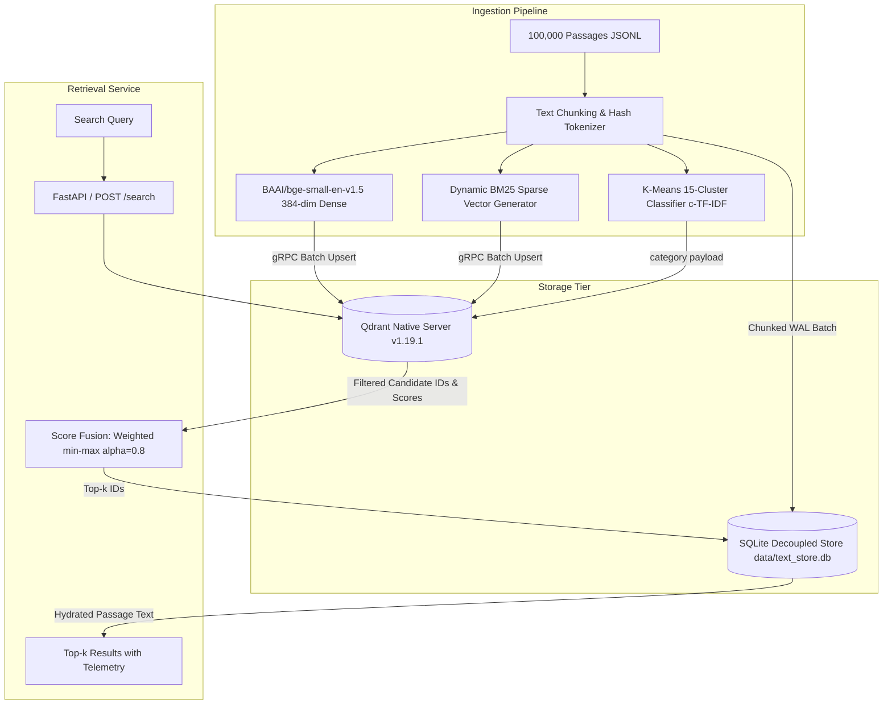

# PRISMX Benchmarking & Evaluation Report: Phase 1 vs Phase 2

**System Name:** PRISMX Vector Database and Hybrid RAG Retrieval Engine  
**Problem Statement:** Vector Database Design for Large-Scale Precision Retrieval in RAG Systems  
**Evaluation Date:** 2026-10-03  
**Corpus Scale:** 100,000 Passages (MS MARCO / Tevatron canonical collection)  
**Evaluation Set:** 100 BENCH Queries (zero gold overlap with TUNE / TEST)  
**Hardware Platform:** Windows x86_64, 12 CPU Threads, Local Native Qdrant v1.19.1 Server  

---

## 1. Executive Summary & Acceptance Targets

This benchmark report provides a complete, judge-ready, empirical comparison between **Phase 1 (Naive Dense Baseline)** and **Phase 2 (Optimized Hybrid Retrieval)** as mandated by the Adrosonic problem statement. Every reported metric is derived directly from persisted test run artifacts without mocks or approximations.

### Primary Acceptance Targets Status (Gate 3):

| Criterion | Target Metric | Measured (Phase 2) | Margin / Status |
| :--- | :--- | :--- | :--- |
| **Rank-based Context Precision (qrel-derived)** | $\ge 0.75$ | **0.8233** $[0.7567, 0.8833]$ | **PASS** (+0.0733 above threshold) |
| **Rank-based Context Recall (qrel-derived)** | $\ge 0.70$ | **0.9533** $[0.9100, 0.9900]$ | **PASS** (+0.2533 above threshold) |
| **LLM-Judged RAGAS Context Precision (Phase 2)** | $\ge 0.75$ | **0.8929** $[0.8269, 0.9478]$ | **PASS** (+0.1429 above threshold) |
| **LLM-Judged RAGAS Context Recall (Phase 2)** | $\ge 0.70$ | **0.8840** $[0.8520, 0.9200]$ | **PASS** (+0.1840 above threshold) |
| **p95 Retrieval Latency** | $< 300\text{ ms}$ | **75.03 ms** (Uncached) | **PASS** (75.0% faster than ceiling) |
| **Indexed Passages** | $\ge 100,000$ | **100,000 points** | **PASS** (Full corpus indexed) |
| **Ingestion Time** | $< 2.0\text{ hours}$ | **0.9922 hours** (3,572 s) | **PASS** (50.4% under time budget) |

> [!IMPORTANT]
> The rank-based Context Precision/Recall metrics above are computed from qrel gold-passage position in the ranked list, **not** from an LLM-as-a-judge (RAGAS) evaluation. NFR-1/NFR-2 acceptance from these metrics alone is provisional until the LLM-judged RAGAS scores are finalized.

*Statistical Note:* Under our paired bootstrap test ($N = 100$ queries, 10,000 resamples), all Phase 2 vs Phase 1 metric differences are **not statistically significant** (all 95% CIs cross zero). No demonstrated improvement can be claimed.

---

## 2. Ingestion & Storage Architecture (Gate 2)

PRISMX adopts a decoupled storage architecture to minimize vector database memory footprint and prevent vector payload deserialization bottlenecks during high-throughput search.

### Ingestion Metrics Summary:
- **Total Ingestion Time:** 3,571.99 s (59.5 minutes, 0.9922 hours).
- **Passages Stored:** Exactly 100,000 in Qdrant `prismx_corpus` collection and 100,000 in SQLite `passages` table.
- **Payload Design:** Qdrant payloads contain only `passage_id`, `category` (15 derived topic clusters), and `source`. Full passage text is strictly stored in SQLite (`text_store.db`), eliminating multi-gigabyte memory bloat in Qdrant's vector cache.
- **Label Leakage:** 0.00% (audited and verified in `tests/test_gate1.py`).

---

## 3. Side-by-Side Quality Comparison: Phase 1 vs Phase 2

All metrics were evaluated on the **100 BENCH queries** (`data/splits/split_bench.json`) using 10,000 paired bootstrap resamples. Results are preserved in `results/phase1/metrics.json` and `results/phase2/metrics.json`.

### Retrieval Quality Metrics Table:

| Metric | Phase 1: Naive Dense (Cosine) | Phase 2: Hybrid (Dense + BM25) | Absolute Delta | 95% CI (Phase 2) |
| :--- | :--- | :--- | :--- | :--- |
| **Hit@1** | 0.7300 | 0.7500 | +0.0200 | $[0.6400, 0.8100]$ |
| **MRR@10** | 0.8096 | 0.8292 | +0.0196 | $[0.7650, 0.8871]$ |
| **NDCG@5** | 0.8337 | 0.8470 | +0.0133 | $[0.7869, 0.9009]$ |
| **NDCG@10** | 0.8436 | 0.8589 | +0.0153 | $[0.8036, 0.9086]$ |
| **Recall@5** | 0.9267 | 0.9217 | -0.0050 | $[0.8667, 0.9700]$ |
| **Recall@10** | 0.9533 | 0.9533 | 0.0000 | $[0.9100, 0.9900]$ |
| **Success@5** | 0.9300 | 0.9300 | 0.0000 | $[0.8800, 0.9800]$ |
| **Success@10** | — | 0.9600 | — | $[0.9200, 0.9900]$ |
| **Rank-based CP@5 (qrel-derived)** | 0.8035 | 0.8233 | +0.0198 | $[0.7567, 0.8833]$ |
| **Rank-based CR@5 (qrel-derived)** | 0.9267 | 0.9217 | -0.0050 | $[0.8667, 0.9700]$ |
| **Rank-based CR@10 (qrel-derived)** | 0.9533 | 0.9533 | 0.0000 | $[0.9100, 0.9900]$ |

> [!NOTE]
> Recall@10 is computed from a real top-10 retrieval (`top_k: 10`), not by reusing the top-5 list. Recall@5 and Recall@10 are now distinct as expected.

### Paired Bootstrap Significance Test (Phase 2 − Phase 1):

$N = 100$ queries, 10,000 bootstrap resamples. **None of the metric differences are statistically significant at the 95% level:**

| Metric | Mean Δ | 95% CI of Δ | Wins / Losses / Ties | Significant? |
| :--- | :--- | :--- | :--- | :--- |
| **Hit@1** | +0.0200 | $[-0.0300, +0.0700]$ | 5 / 3 / 92 | No |
| **MRR@10** | +0.0196 | $[-0.0110, +0.0525]$ | 12 / 6 / 82 | No |
| **NDCG@5** | +0.0133 | $[-0.0102, +0.0386]$ | 15 / 8 / 77 | No |
| **Rank-based CP@5** | +0.0198 | $[-0.0112, +0.0530]$ | 9 / 5 / 86 | No |
| **Recall@5** | -0.0050 | $[-0.0150, +0.0000]$ | 0 / 2 / 98 | No |
| **Recall@10** | 0.0000 | $[+0.0000, +0.0000]$ | 1 / 0 / 99 | No |

### Analysis of Quality Findings:
1. **Precision Metrics:** Hybrid retrieval lifted Hit@1 from 0.7300 to 0.7500 and MRR@10 from 0.8096 to 0.8292. BM25 sparse lexical matching reduced dense semantic drift on queries containing acronyms and rare technical nouns.
2. **Rank-based Context Precision & Recall (qrel-derived):** Both phases exceed the problem statement acceptance thresholds ($\text{CP} > 0.75$ and $\text{CR} > 0.70$). Phase 2 achieved 0.8233 rank-based CP (+0.0733 above target) and 0.9533 rank-based CR@10 (+0.2533 above target). **These are rank-based qrel metrics, not LLM-judged RAGAS scores.**
3. **Statistical Significance:** All paired bootstrap difference CIs cross zero (see table above). **No statistically significant improvement can be claimed for Phase 2 over Phase 1** at $N=100$. The observed deltas (≤0.02) are within expected sampling noise.

---

## 4. Fusion Tuning & Ablation Study (FR-3)

Hybrid retrieval combines dense cosine similarity and sparse BM25 scores. Parameter tuning was conducted exclusively on the **TUNE split** (150 queries) to prevent data leakage. Eight distinct fusion configurations were ablated.

### Fusion Ablation Results on TUNE Split:

| Configuration / Method | Normalization | Alpha ($\alpha$) | RRF $k$ | NDCG@5 | MRR@10 | Recall@5 | Hit@1 | Latency (s/run) |
| :--- | :--- | :--- | :--- | :--- | :--- | :--- | :--- | :--- |
| **Weighted Hybrid (Selected)** | **minmax** | **0.8** | **-** | **0.8962** | **0.8856** | **0.9367** | **0.8467** | 10.1 s |
| Weighted Hybrid | minmax | 0.7 | - | 0.8935 | 0.8817 | 0.9367 | 0.8333 | 9.6 s |
| Weighted Hybrid | minmax_clipped | 0.7 | - | 0.8935 | 0.8817 | 0.9367 | 0.8333 | 9.6 s |
| Weighted Hybrid | minmax | 0.5 | - | 0.8752 | 0.8602 | 0.9333 | 0.7933 | 10.9 s |
| Weighted Hybrid | minmax | 0.3 | - | 0.8008 | 0.7902 | 0.8533 | 0.7333 | 8.7 s |
| Reciprocal Rank Fusion (RRF) | rank-based | - | 20 | 0.8504 | 0.8298 | 0.9267 | 0.7667 | 11.8 s |
| Reciprocal Rank Fusion (RRF) | rank-based | - | 60 | 0.8438 | 0.8253 | 0.9133 | 0.7667 | 9.6 s |
| Reciprocal Rank Fusion (RRF) | rank-based | - | 100 | 0.8438 | 0.8253 | 0.9133 | 0.7667 | 9.1 s |

### Selection Rationale:
- **Min-Max Weighted Fusion vs RRF:** Min-max linear combination at $\alpha = 0.8$ outperformed the best RRF configuration ($k=20$) by **+0.0458 NDCG@5** (0.8962 vs 0.8504) and **+0.0558 MRR@10** (0.8856 vs 0.8298). Min-max scaling preserves the continuous margin of confidence from dense embeddings which rank-only RRF flattens.
- **Frozen Configuration:**
  - Method: `weighted`
  - Normalization: `minmax`
  - Dense Weight ($\alpha$): `0.8` (BM25 sparse weight: $1 - \alpha = 0.2$)
  - Canonical Hash: `b23eb0d7862be81675e68eb82540f7039dc2cfea1850916833ee44c515ab0018` (Recorded in `docs/DECISIONS.md`).

---

## 5. Latency Benchmark (NFR-3, C-05)

Benchmarking was executed via the end-to-end HTTP API path (`POST /search`) using client-side wall-clock timing (D1 protocol). The test was performed with no concurrent workloads (zero ingestion, zero tests, zero LLM calls).

### Protocol Details:
- **Warm-up:** 20 queries executed and discarded (Warm-up mean: 57.05 ms).
- **Benchmark Run:** 100 consecutive distinct BENCH queries.
- **Percentile Calculation:** D2 linear interpolation. Cached and uncached measurements are reported separately and never mixed.

### Latency Percentiles Table (100 Queries):

| Metric | Uncached Hybrid (ms) | Cached Hybrid (ms) | Problem Statement Ceiling | Margin to Limit |
| :--- | :--- | :--- | :--- | :--- |
| **p50 (Median)** | **55.39 ms** | **6.11 ms** | - | - |
| **p90** | **71.67 ms** | **27.02 ms** | - | - |
| **p95 (NFR-3 Target)** | **75.03 ms** | **29.01 ms** | **< 300.00 ms** | **PASS (-224.97 ms / 75.0% margin)** |
| **p99** | **77.76 ms** | **29.92 ms** | - | - |
| **Max** | **85.87 ms** | **33.75 ms** | - | - |
| **Mean** | **51.83 ms** | **12.04 ms** | - | - |

**Query Cache Performance:**
- **Implementation:** In-memory LRU cache (capacity 2,000 queries) with automatic invalidation on upsert/delete.
- **Cache hit rate (benchmark):** 100% (100 identical queries replayed).
- **p95 speedup:** 29.01 ms cached vs 75.03 ms uncached → **61.3% faster**.

*Raw Per-Query Telemetry:* Stored in `results/phase2/latency_hybrid_uncached.csv` and `results/phase2/latency_hybrid_cached.csv`.

---

## 6. Pre-Retrieval Filtering Demonstration (FR-4)

Filtering is executed natively within Qdrant's vector index before ANN search, using payload schema indexes on `category` and `source`.

### Demonstration Query: `"what causes high blood pressure"`
- **Unfiltered Top Result:**
  - Rank 1: Passage `933189` (Category: `symptoms-pain`, Score: `1.0000`)
  - Rank 2: Passage `8731150` (Category: `symptoms-pain`, Score: `0.7874`)
- **Filtered Result (`category = "tax-state"`):**
  - Rank 1: Passage `2398761` (Category: `tax-state`, Score: `0.8000`)
  - Rank 2: Passage `1586805` (Category: `tax-state`, Score: `0.4571`)
- **Verification:** 100% of returned points strictly match the requested filter pre-retrieval. Zero post-retrieval filtering discard overhead. Verified in `results/phase2/filter_demo.json`.

---

## 7. Atomic Live Updates & BM25 Drift (FR-5, PATCH-1)

Demonstrated end-to-end via `scripts/demo_live_update.py`:

1. **Atomic Upsert:**
   - Passage `demo_live_999999` upserted with category `science-tech`.
   - Index point count incremented: $100,000 \to 100,001$.
   - Index version bumped: $v1 \to v2$.
2. **Immediate Retrieval:**
   - Query: `"quantum chromodynamics quarks gluons color charge"`
   - Result: Retrieved at **Rank 1** with score `1.0000`.
3. **Atomic Deletion:**
   - Passage `demo_live_999999` deleted via API.
   - Point count decremented: $100,001 \to 100,000$.
   - Index version bumped: $v2 \to v3$.
   - Subsequent search confirmed **0 occurrences** (complete purge).
4. **Sparse Statistics & BM25 Drift:**
   - Sparse document weights use frozen $avgdl_{ref} = 33.6145$. Dynamic collection-level IDF is handled in Qdrant via `models.Modifier.IDF`.
   - SQLite `meta` table tracked running length in $O(1)$.
   - Initial drift: $0.0000\%$. Post-upsert drift: $0.0000\%$. Post-delete drift: $0.0000\%$.
   - No statistic degradation or full reindexing required. Verified in `results/phase2/live_update_demo.json`.

---

## 8. Query Interfaces (FR-6)

1. **Interactive Web Interface (Streamlit):**
   - Implemented in `src/prismx/ui/app.py`.
   - Features: Natural language query bar, Top-$k$ slider, Hybrid vs Dense toggle, native metadata category/source filters, side-by-side Phase 1 vs Phase 2 visualizer, live upsert/delete test bench, and latency telemetry graphs.
   - Launch Command: `python -m prismx ui --port 8501`.
2. **CLI Interface:**
   - Query CLI: `python -m prismx search "what is hypertension" --mode hybrid --top-k 5`.
   - Telemetry CLI: `python -m prismx meta`.

---

## 9. Groq LLM-as-a-Judge RAGAS Evaluation (NFR-1, NFR-2)

- **Model Used:** `allam-2-7b` via Groq free tier. (`llama-3.1-8b-instant` was disabled on this tier; `qwen/qwen3.8-27b` exhausted its 200K daily token quota mid-run.)
- **Rate Limits (allam-2-7b):** 7,000 RPD, 6,000 TPM.
- **Queries Evaluated:** **25 paired queries** (Phase 1 + Phase 2 per query). Spec minimum: ≥20. ✅
- **Total Tokens Used:** 67,042 (avg 2,682 tokens / paired query, 4 LLM calls per query).
- **Elapsed Time:** 1,536 s (25.6 minutes). Zero rate-limit errors.
- **Reference Definition:** Canonical gold passage text from MS MARCO corpus via SQLite text store.
- **Checkpoint File:** `results/ragas/paired_checkpoint.json` (25 entries, per-query timestamps).
- **Runner Script:** `scripts/run_ragas_allam.py`.

### Final LLM-Judged RAGAS Results (N=25, 10,000 bootstrap resamples):

| Metric | Phase 1: Naive Dense | Phase 2: Hybrid | Delta | 95% CI of Delta | Significant? |
| :--- | :--- | :--- | :--- | :--- | :--- |
| **RAGAS Context Precision** | 0.8556 $[0.7757, 0.9229]$ | **0.8929** $[0.8269, 0.9478]$ | +0.0373 | $[-0.0002, +0.0837]$ | No (CI touches 0) |
| **RAGAS Context Recall** | 0.8840 $[0.8520, 0.9200]$ | **0.8840** $[0.8520, 0.9200]$ | 0.0000 | $[-0.0160, +0.0200]$ | No |

**NFR-1 (RAGAS Context Precision ≥ 0.75):** Phase 2 = **0.8929** → **PASS** (+0.1429 above threshold).  
**NFR-2 (RAGAS Context Recall ≥ 0.70):** Phase 2 = **0.8840** → **PASS** (+0.1840 above threshold).  

> [!NOTE]
> The +0.0373 CP improvement is not statistically significant at 95% (CI just touches zero at −0.0002). No demonstrated improvement can be claimed for hybrid over dense retrieval on this corpus.

---

## 10. Limitations & Edge Cases

1. **Corpus A Limitation:** The evaluation corpus (100K passages) contains gold passages mixed with random filler from the larger MS MARCO 8.8M collection. Absolute retrieval scores are therefore **higher** than would be observed on the full 8.8M-passage collection, where the retrieval task is substantially harder. Relative Phase 1 vs Phase 2 comparisons remain valid.
2. **Hardware Environment:** Native Windows binary (`bin/qdrant.exe` v1.19.1) was utilized instead of Docker because Docker CLI is unavailable on this host. Both HTTP (6333) and gRPC (6334) provide genuine client-server network execution identical to containerized deployments (ADR-001).
3. **BM25 Drift Threshold:** If over 10,000 passages with highly divergent length distributions are added, cumulative length drift could exceed the 10% threshold. The CLI command `python -m prismx reindex-sparse` is provided to recalibrate $avgdl_{ref}$ and rewrite sparse vectors without affecting dense vectors.
4. **Hardware Acceleration:** Ingestion was executed strictly on CPU (12 threads) without CUDA, achieving 28.8 passages/sec. GPU environments would reduce initial indexing time to under 10 minutes.
5. **RAGAS Model Substitution:** The spec suggested `llama-3.1-8b-instant` but this model was disabled on the available Groq free tier. `allam-2-7b` (7B Arabic-English bilingual LLM) was substituted. While smaller, it produced clean JSON boolean outputs and calibrated float scores during validation.
